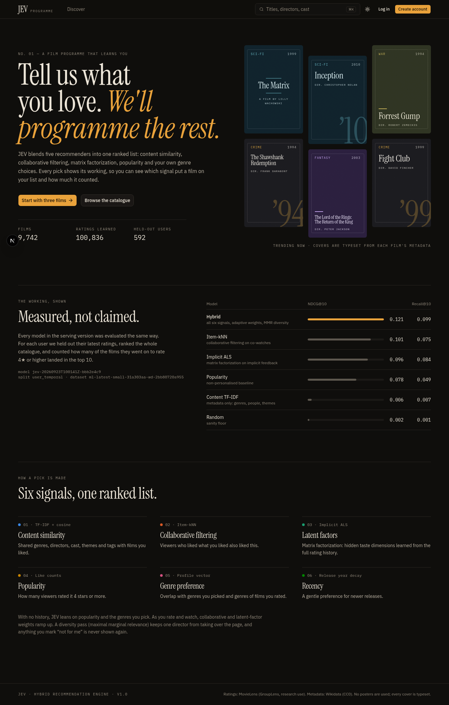
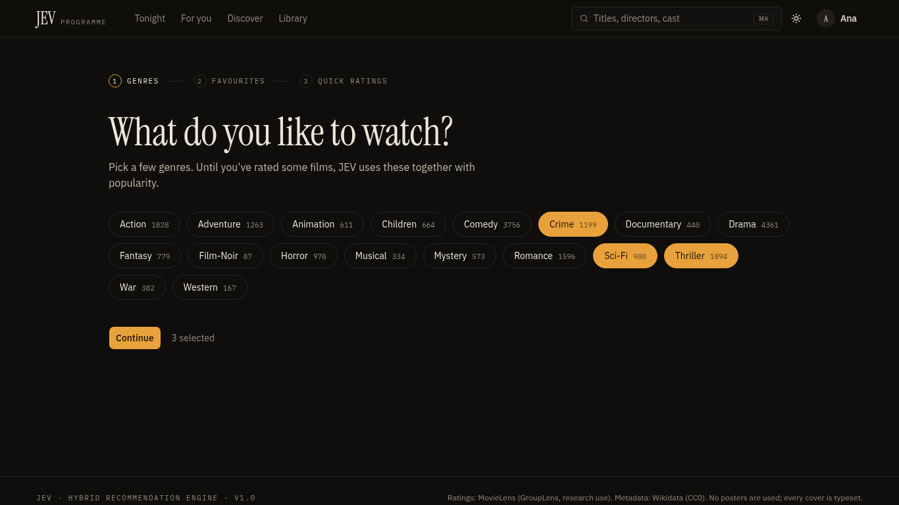
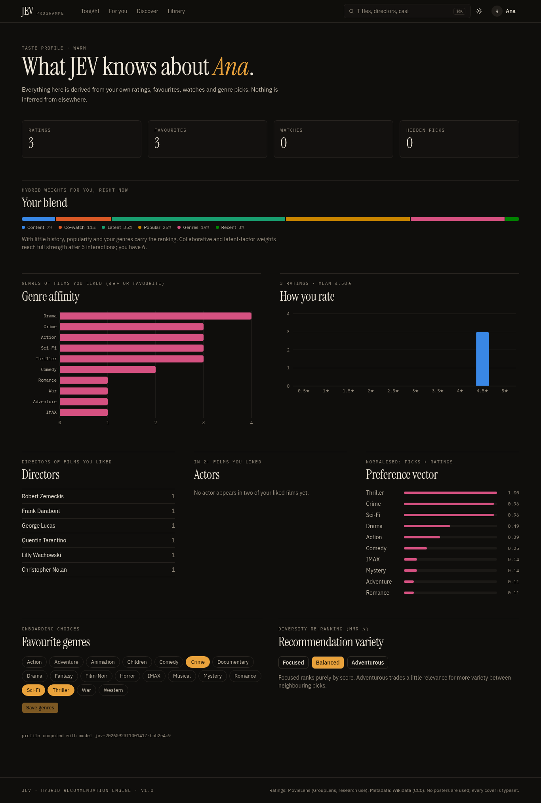
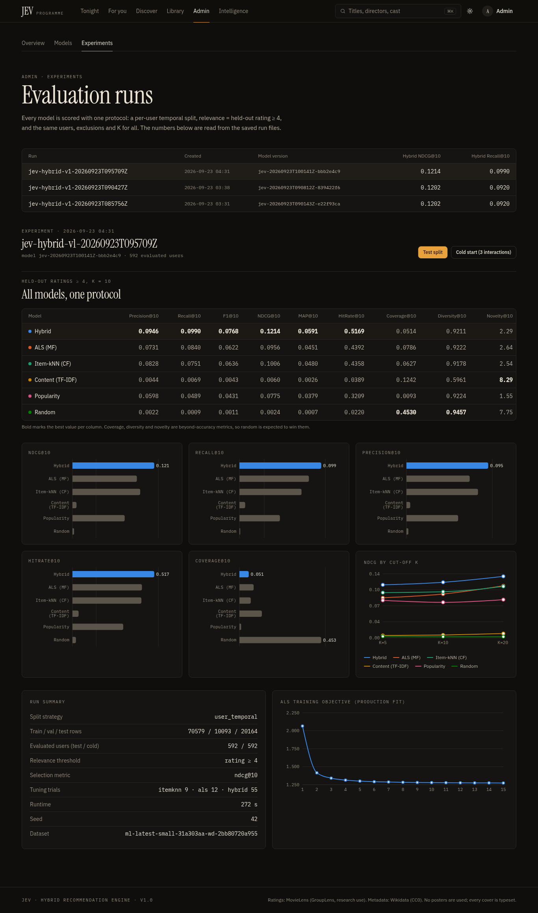

# JEV — Intelligent Decision & Early-Warning Engine

**Version 1.2.0** · [Platform design](docs/platform.md) · [Demo walkthrough](docs/demo.md) · [Changelog](CHANGELOG.md) · [Status report](docs/progress.md)

JEV is a reusable intelligence engine. It turns changing data into **signals, trends, anomalies, forecasts, risk
assessments, structured decisions, explanations, recommendations and actions**. Every output carries its evidence and
an honestly labelled confidence, and every stage is evaluated offline on real data.

Domain knowledge lives in **domain adapters**. Two ship today:
- **Movies**, the first adapter and the reference implementation. It is a full hybrid recommender (popularity,
  TF-IDF content, item-kNN, implicit ALS, adaptive hybrid with MMR diversity) on MovieLens. JEV watches its audience,
  catalogue and model, detects each member's preference drift, and decides *how* recommendations should be produced
  before producing them.
- **Generic structured dataset**, any time-stamped CSV plus a YAML config. The demo uses monthly US and state
  unemployment rates (BLS via FRED, public domain). The same engine raises early warnings of rising unemployment
  when you replay it as of 2008 or 2020.


**See it in five minutes:** [docs/demo.md](docs/demo.md). Run locally with `npm run dev`.

## Problem statement
Organisations sit on streams of changing data but act on them late. Dashboards show numbers without saying what is
changing, how surely, what is likely next, how much it matters, or what to do. Single models ("a recommender", "a
forecaster") answer one narrow question and hide their uncertainty. JEV chains the whole path from observation to
action:

- it detects what is changing, and whether it is unusual;
- it predicts where each series is heading, with calibrated uncertainty;
- it scores the risk;
- it makes **bounded, typed decisions** from that evidence, including whether a situation deserves an early warning;
- it turns those decisions into warnings, recommendations and actions;
- it learns from operator feedback.

The architecture does not depend on the domain, so the same engine serves a film platform and a labour-market
dataset.

## At a glance
| | |
|---|---|
| Engine | Domain-independent core (`ml/jev_ml/core`): series · signals · trends and change points · anomalies · forecasts · risk · JEV decisions · early warnings · actions · scenarios · drift · evaluation |
| Domains | **Movies**: MovieLens 100,836 ratings, 9,742 films, plus Wikidata; hybrid recommender. **Generic**: any CSV + YAML; demo is monthly unemployment rates for the US (from 1948) and 12 states (from 1976), plus 4 census-region means |
| Decisions | Typed (`boolean` / `choice` / `score`), versioned policies, confidence labelled `probability`, `margin`, `interval`, `evidence` or `rule`, and explicit abstention |
| Recommender (test, 592 users) | Hybrid NDCG@10 **0.1214**: +21 % over the best single model |
| Stack | FastAPI · SQLAlchemy + Alembic · PostgreSQL · Redis · Next.js 16 + TypeScript · Tailwind v4 · Recharts · Docker Compose |
| Laptop footprint | CPU only. Movie intelligence run ≈ 1 s, unemployment run ≈ 0.2 s, ≈ 25 ms per recommendation request |

## System architecture
```
                 ┌──────────────────────── JEV core (ml/jev_ml/core) ──────────────────────┐
 data source ──► │ validate → series → signals → trends / change points → anomalies        │
 (adapter)       │ → forecasts → risk → JEV decisions → early warnings → actions            │
                 │ → evidence & explanations · scenarios · drift · feedback · evaluation    │
                 └──────────▲───────────────────────────────────────────▲───────────────────┘
                            │ observations + series specs                │ domain extras (hooks)
        ┌───────────────────┴──────────────┐           ┌─────────────────┴──────────────────────────┐
        │ domains/generic: any CSV + YAML   │           │ domains/movie: MovieLens + app DB,         │
        │ (US unemployment demo)            │           │ hybrid recommender, raters, lapse, model   │
        └───────────────────────────────────┘           │ governance, preference drift, strategy     │
                                                        └────────────────────────────────────────────┘
Next.js console + member app ──/api/*──► FastAPI (/intel/*, /me/intelligence, /recommendations, …)
                                            ├──► PostgreSQL (runs, warnings, decisions, evidence, audit, …)
                                            └──► Redis (cache, rate limits)
```
Details: [ARCHITECTURE.md](ARCHITECTURE.md) · [docs/platform.md](docs/platform.md).

## Domains
| Domain | Data | What JEV produces |
|---|---|---|
| **Movies** (`movie`) | MovieLens ratings, app ratings/feedback, the served-recommendation log, model registry | genre and platform trends; spikes; suspicious raters; audience lapse forecasts; model governance; per-member preference drift → recommendation strategy → recommendations |
| **Generic** (`generic:<name>`) | any long CSV (time, entity, value, optional groups) + `configs/domains/<name>.yaml` | per-entity trends, change points, anomalies, forecasts, adverse-direction risk, early-warning decisions and warnings |

Adding a domain means writing a YAML file for a generic dataset, or implementing the `DomainAdapter` protocol for
anything richer ([platform.md §3](docs/platform.md#3-domain-adapter-protocol-jev_mlcoreadapterpy)).

## Movies domain: hybrid recommender
1. **Popularity**: log like-counts, time-decayed trending, and a Bayesian-average rating.
2. **Content-based**: separate TF-IDF per field (genres, directors, cast, keywords, tags, title, description, decade),
   field-weighted and cosine-scored, with a signed user taste vector.
3. **Collaborative filtering**: item-item cosine with shrinkage over the sparse implicit matrix, top-k neighbours.
4. **Matrix factorization**: implicit ALS (Hu–Koren–Volinsky), with exact fold-in for new users and exact score attribution.
5. **Hybrid**: candidate generation → filtering → six normalised signals → interaction-adaptive weighted score →
   quality floor → MMR diversity → top-K with pagination. Every item carries its per-signal breakdown and a reason
   built from real contributions: *"Recommended because of your interest in Christopher Nolan"*, *"Because you liked
   Inception"*, *"Viewers who enjoyed The Dark Knight also loved this"*.

Full description: [docs/recommendation-algorithms.md](docs/recommendation-algorithms.md).

## Dataset
MovieLens (GroupLens, research licence) is downloaded by script and MD5-verified; it is never committed. Wikidata (CC0)
enrichment is fetched by IMDb id: 9,651/9,742 films matched, 98.5% have a director. Fields, sizes, validation and
versioning are documented in [docs/ml-pipeline.md](docs/ml-pipeline.md).

## Installation
Requirements: Python 3.11+ with [uv](https://docs.astral.sh/uv/), Node 20.9+ with pnpm. Docker is optional.
```bash
cp .env.example .env            # set secrets
uv sync
cd frontend && pnpm install && cd ..
```

## Training
```bash
uv run python scripts/download_data.py      # --skip-enrichment to work offline
uv run python scripts/preprocess_data.py
uv run python scripts/train_models.py       # tune on validation, evaluate on test, train + register (≈4.5 min CPU)
uv run python scripts/train_models.py --quick   # no tuning
uv run python scripts/generate_recommendations.py --rate 79132=5 109487=5 --genres Sci-Fi
```

## Movies domain: recommender evaluation
Per-user temporal split (70/10/20), relevance = held-out rating ≥ 4, full-catalogue ranking with consumed items
excluded, the same protocol for every model. Numbers from run `jev-hybrid-v1-20260923T095709Z`:

| Model (test, K=10) | Precision | Recall | NDCG | MAP | HitRate | Coverage | Diversity | Novelty |
|---|---|---|---|---|---|---|---|---|
| **Hybrid** | **0.0946** | **0.0990** | **0.1214** | **0.0591** | **0.5169** | 0.0514 | 0.9211 | 2.29 |
| Item-kNN | 0.0828 | 0.0751 | 0.1006 | 0.0480 | 0.4358 | 0.0627 | 0.9178 | 2.54 |
| ALS | 0.0731 | 0.0840 | 0.0956 | 0.0451 | 0.4392 | 0.0786 | 0.9222 | 2.64 |
| Popularity | 0.0598 | 0.0489 | 0.0775 | 0.0379 | 0.3209 | 0.0093 | 0.9224 | 1.55 |
| Content | 0.0044 | 0.0069 | 0.0060 | 0.0026 | 0.0389 | 0.1242 | 0.5961 | 8.29 |
| Random | 0.0022 | 0.0009 | 0.0024 | 0.0007 | 0.0220 | 0.4530 | 0.9457 | 7.75 |

On the cold-start protocol (3 interactions) popularity still leads (NDCG@10 0.046 vs hybrid 0.035). See
[docs/evaluation.md](docs/evaluation.md) for the full tables, plots and discussion.

## The intelligence pipeline
The same stages run for every domain. Movie-only stages (raters, lapse, model governance, preference drift) plug
in through the adapter's hooks.

```
INGEST → VALIDATE → UNDERSTAND → DETECT → PREDICT → ASSESS → DECIDE → ACT/EXPLAIN → FEEDBACK
sources  quality    monthly     trends,   forecasts, risk    typed      warnings,   operator verdicts
         freshness  series,     change    lapse      scores  decisions  action      → evaluation
                    signals     points,   model                         plan
                                anomalies
```
- **Leak-free replay.** Every run analyses the data *as of* a timestamp and never looks past it. Replaying as of
  2017-07-01 raises a high warning for the May-2017 Horror spike. At that date the retrain and serving decisions
  abstain, because the model was trained on later data.
- **Detection:**
  - trends: Mann–Kendall plus a Theil–Sen slope with 95 % CI, and Benjamini–Hochberg control across series;
  - change points: a mean shift tested against an AR(1) null;
  - series anomalies: robust (MAD) z-scores against a trailing baseline;
  - rater anomalies: an IsolationForest over behavioural features.
- **Prediction:**
  - Damped Holt, moving-average and naive forecasts, selected per series by rolling-origin MASE, with
    finite-sample 80 % intervals.
  - A lapse model, a calibrated logistic regression that estimates P(no rating in 180 days), trained and tested on
    separate time cut-offs.
- **Risk:** each risk scores likelihood × impact, shrunk by confidence and data quality, and lists its contributing
  factors.
- **Decisions ("JEV").** The decision layer is JEV itself, not an external LLM. Each decision is a fixed question
  with a fixed answer type (`boolean`, `choice`, `score`) and a versioned policy. Normal code does all arithmetic;
  the policy only combines evidence. Every decision stores:
  - the exact state it saw and its rationale;
  - a confidence labelled `probability` (paired bootstrap or calibrated model), `margin` (not a probability) or
    `rule`;
  - an explicit abstention when the data is insufficient.
- **Early-warning decision.** For every situation (a series or an entity with evidence), JEV answers
  `early_warning_level`: `NO_ACTION | MONITOR | WARNING | URGENT_ACTION`.
  - It is scored from the situation's structured evidence: signal strength, trend direction and q-value, anomaly
    score, forecast direction against the domain's adverse direction, and risk.
  - The policy is monotone and versioned, with a margin confidence.
- **Early warnings are downstream of that decision.**
  - A warning is raised only at `WARNING` or `URGENT_ACTION`, and it links its `decision_id`.
  - Each warning shows its trigger condition (observed vs threshold), evidence and recommended action.
  - They are deduplicated by key. Their lifecycle runs `new → acknowledged → investigating → resolved | dismissed`,
    with an audit trail.
  - A dismissal suppresses the warning unless its severity escalates; a resolved warning that fires again reopens.
- **What-if and feedback:**
  - Scenarios bend a series' fitted trend (continue, slow, reverse, shock) and compare the projections against the
    baseline band.
  - Operators mark decisions, warnings, actions and forecasts as correct or useful. The system reports decision
    accuracy and warning precision from those verdicts.

**Offline evaluation** (`uv run python scripts/evaluate_intelligence.py`, run `intel-eval-20260923T134257Z`):

| Component | Protocol | Result | Baseline |
|---|---|---|---|
| Forecasts (21 series) | model picked on origins 1–12, scored on 13–24 | median MASE 0.93; beats naive on 21/21; 80 % interval coverage 0.95 | naive MASE 1.15 |
| Lapse model | temporal holdout, 1,017 train / 493 test rows | AUC 0.886 · Brier 0.115 · ECE 0.061 | recency rule AUC 0.779 · Brier 0.155 |
| Shilling detection | synthetic, labelled attack profiles injected into real data | AUC 0.95 random · 0.99 average · 0.92 bandwagon | deviation rule F1 0 |
| Series anomalies | 756 spikes/drops injected into real series | 50 % detected overall (73–76 % at ≥ 5σ); 2 % false-alarm rate | — |
| Change points | synthetic AR(1) matched to real volume | 32.5 % detected; 7 % false alarms (nominal 1 %) | — |

**Preference drift and recommendation strategy (movies).**
- For each member, JEV compares the historical and recent windows on six aspects: genre mix, rating level, activity
  rate, film age, content similarity and acceptance. Permutation tests work on whole active days, with Holm
  correction.
- JEV then decides the `recommendation_strategy` (`standard | adapt_to_recent | explore`), and `/recommendations`
  serves under that decision. Each list carries the decision id and its evidence.
- A per-member what-if ranks the real model's recommendations under projected preferences (continue, accelerate,
  reverse), with 80 % bands from resampling.

**Platform evaluation** (`scripts/evaluate_domains.py`, run `platform-eval-20260924T051637Z`, 6-period horizon;
`scripts/evaluate_drift.py`, run `drift-eval-20260924T045528Z`):

| Measure | Movies | US unemployment |
|---|---|---|
| Forecast median MAE / RMSE | 47.8 / 59.1 ratings | 0.145 / 0.177 points |
| Forecast MASE vs naive | 0.93 vs 1.15 (better on 21/21) | 1.52 vs 1.41 (no better than naive) |
| 80 % interval coverage | 0.95 | 0.61 |
| Warning precision / false-positive rate (monthly leak-free replays) | lapse 18/18, but the base rate is 1.0, so uninformative | 0.36 / 0.39 at base rate 0.30; recall 0.52 |
| Early-warning decision flip rate between monthly replays | 0.23 (0.026 across the WARNING line) | 0.13 (2006–10) · 0.22 (2019–21) |
| Drift detector, labelled splices of real histories (20 events) | precision 0.92 · recall 0.29 · false-positive rate 0.026 on preference aspects | — |
| Drift adaptation effect (NDCG@10, models refitted without test data) | +0.006 [+0.001, +0.013] on only 7 drifting users; nothing measurable on larger groups, so the policy keeps `standard` | — |

A full run over the real data takes about 1 s on a laptop CPU (0.85 s pipeline + persistence). Design, contract and method notes:
[docs/intelligence.md](docs/intelligence.md).
```bash
uv run python scripts/run_intelligence.py --as-of 2017-07-01   # one run, printed as JSON
uv run python scripts/evaluate_intelligence.py                 # offline evaluation → experiments/intel-eval-*/
```

## API
REST under FastAPI with JWT (httpOnly cookie or bearer) and CSRF protection for cookie writes. Main endpoints:
`/auth/*`, `/users/me*`, `/movies*`, `/recommendations` (+ `/similar/{id}`, `/trending`, `/because-you-watched`,
`/similar-to-favorites`, `/feedback`, `/history`), `/models*`, `/experiments*`, `/health`, `/health/ml`.
Operators (admins) also get `/intel/*`: status, runs (with replay `as_of`), signals, trends, anomalies, predictions, series, risks, decisions (incl. score decisions and `/intel/decisions/batches`), warnings (lifecycle), actions, scenarios, feedback, evaluation and evaluation runs, evidence search, history across runs and recommender monitoring, plus `/admin/metrics` and `/admin/audit`. Recommendation items carry a calibrated `confidence` (P(rating ≥ 4)), or null.
Reference: [docs/api.md](docs/api.md). OpenAPI UI is at `http://localhost:8000/docs` in development.

## Frontend
Next.js 16 App Router. Pages: `/` landing (live metrics), `/login`, `/register`, `/onboarding` (genres → favourites →
quick ratings), `/home` (six shelves: Recommended for you, Because you watched, Similar to your favourites, Trending,
Popular, New discoveries), `/discover`, `/movies/[id]`, `/recommendations` (full ranking with "Why this?"
breakdowns and feedback), `/profile` (taste profile), `/history`, `/favorites`, `/admin`, `/admin/models`,
`/admin/experiments`, and the Intelligence console under `/intel` (overview, signals, trends, anomalies, predictions, risks, early warnings, decisions, actions, what-if scenarios, feedback, evaluation, recommender monitoring, evidence explorer, audit log, system health).

The design is a festival programme printed for a dark screening room. It uses warm near-black and paper tones, a
single tungsten-amber accent, serif display type, and typeset covers generated from each film's metadata instead of
posters. A light "paper" theme is included. It is responsive from 360 px phones to 1440 px laptops, keyboard
accessible, and respects reduced-motion settings.
```bash
npm run dev                                      # API :8000 + web :3000 together; Ctrl+C stops both
# or separately:
uv run uvicorn jev_api.main:app --port 8000      # SQLite + in-memory cache by default
cd frontend && pnpm dev                          # http://localhost:3000
```

## Docker
```bash
docker compose --profile train run --rm trainer  # first run: data + training into ./data ./models ./experiments
docker compose up -d --build                     # postgres, redis, api, web → http://localhost:3000
uv run python scripts/acceptance_test.py --base http://localhost:3000/api --admin-password "$JEV_ADMIN_PASSWORD"
```
The trainer also writes the recommendation-confidence calibration and the intelligence evaluation. The API is reachable
only through the web proxy (`/api/*`), and forwarded headers are not trusted by default. The acceptance test (58 checks:
the recommender journey plus the intelligence layer end to end) passes against the Docker stack. See
[docs/deployment.md](docs/deployment.md).

## Testing
```bash
uv run pytest                   # 174 tests: unit 47, ML 9, intelligence 39, API integration 79 (~25 s; 173 pass + 1 PostgreSQL-only skip; real-data checks skip without data)
uv run ruff check . && uv run ruff format --check . && uv run mypy
cd frontend && pnpm test         # 65 Vitest tests in 6 files (helpers, CSP, safe redirects, components; jsdom)
cd frontend && pnpm exec next typegen && pnpm exec tsc --noEmit && pnpm exec eslint src && pnpm build
uv run python scripts/acceptance_test.py --base http://localhost:3000/api   # 58 end-to-end checks against a running stack
uv run python scripts/capture_screenshots.py     # real-browser user journey (Chrome) → docs/screenshots
```

## Screenshots
| | |
|---|---|
|  |  |
|  |  |
|  |  |
|  |  |

Intelligence console:

| | |
|---|---|
|  |  |
|  |  |
|  |  |
|  |  |
|  |  |
|  | |

## Limitations
- **Cold start**: with about 3 interactions, plain popularity still beats the hybrid on NDCG@10.
- MovieLens-small is small (610 users) and old (ratings to 2018), so absolute metrics are modest and results may not
  transfer to other domains. The evaluation split allows cross-user temporal leakage (documented; a global temporal
  split is available).
- Wikidata metadata is incomplete: keywords cover 36% of films, and cast lists are unordered (Wikidata has no billing order).
- App users are not in the training data. They are served by fold-in, and their feedback is not yet fed back into retraining.
- No password reset or email verification; JWTs are not revocable before expiry.
- Posters are typeset, not artwork.
- **Intelligence layer:**
  - MovieLens is a static 2018 snapshot, so every live signal needs real app traffic before it says anything. Until
    then those stages report "skipped" instead of guessing.
  - On this thin stream (10–15 active raters a month), genre trends rarely survive false-discovery control.
  - The change-point test over-alarms (7 % vs 1 % nominal).
  - Recommendation confidence is well calibrated (ECE ≤ 0.0014) but discriminates weakly (AUC 0.57–0.63).
  - Open warnings are never auto-resolved.
  - The rater detector spends much of its 2 % review budget on genuine heavy users.
  - Some impact weights and action efforts are declared estimates, and they are labelled as such.
  - The lapse base rate is high (74 %), so a lapse warning mostly restates that most raters do not return.

## Future improvements
Separate cold-stage weights or learning-to-rank on logged feedback · sequence-aware models · scheduled retraining that
includes app interactions · online A/B tests driven by the experiment table · larger MovieLens variants · optional
TMDB artwork. See [docs/roadmap.md](docs/roadmap.md) and [docs/progress.md](docs/progress.md).

## Licence and credits
Code: MIT. Data: MovieLens © GroupLens (research use; not redistributed); Wikidata CC0.
