# JEV — Intelligent Decision & Early-Warning Engine

**Version 1.3.0** · [Architecture](ARCHITECTURE.md) · [Intelligence pipeline](docs/INTELLIGENCE_PIPELINE.md) ·
[Demo walkthrough](docs/demo.md) · [Changelog](CHANGELOG.md) · [Completion report](docs/PROJECT_COMPLETION_REPORT.md)

JEV turns changing data into **signals, trends, anomalies, forecasts, risk scores, typed decisions, early warnings
and actions**. Every output carries its evidence, a confidence whose meaning is labelled, and a lineage back to the
data it came from. Every stage is evaluated offline on real data, and the evaluation reports its negative results.

The engine (`ml/jev_ml/core`) does not know any domain. Domain knowledge lives in adapters:

- **Movie Intelligence**, the reference implementation: a hybrid recommender on MovieLens (popularity, TF-IDF content,
  item-kNN, implicit ALS, adaptive hybrid with MMR diversity). JEV watches its audience, catalogue and model, detects
  each member's preference drift, decides *how* a member's recommendations should be produced, and governs model
  retraining with a promotion gate.
- **US unemployment** (`generic:us-unemployment`): monthly BLS rates via FRED for the US, 12 states and 4 regions,
  from one CSV and one YAML file, with no domain code.
- **CTA ridership** (`generic:cta-ridership`): daily Chicago Transit Authority boardings (system, bus, rail, top
  stations), with a weekly cycle, a holiday calendar and publication lag, again from YAML only.

JEV runs on a laptop CPU: SQLite and an in-process cache without Docker, PostgreSQL and Redis with it. No GPU and no
external model API are involved; the decision layer is a set of versioned rules, not an LLM.

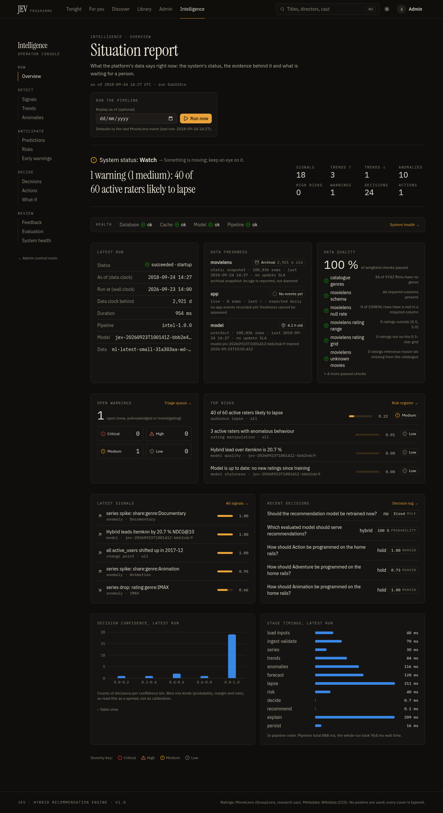

## Contents
[Architecture](#architecture) · [Pipeline](#the-intelligence-pipeline) · [Domains](#domains) ·
[Technical highlights](#technical-highlights) · [Evaluation](#evaluation-honest-numbers) · [Limitations](#limitations) ·
[Reproduce](#reproducibility) · [Demo](#demo-workflow) · [Tests](#tests) · [Screenshots](#screenshots) ·
[Summary](#summary) · [Roadmap](#roadmap)

## Architecture

```
 browser ──► Next.js 16 (App Router)  /api/* rewrite · nonce CSP · signs client address (x-jev-client)
                    │
                    ▼
 FastAPI (backend/jev_api)            JWT (cookie + CSRF header, or bearer) · revocable sessions · service tokens
   routers  auth · users · me · movies · recommendations · intel · events · governance · experiments/online · admin
   services recommend ─► strategy decision ─► experiment arm ─► serve + log exposure
            events     ─► append-only log + projections (one transaction) · idempotency keys
            intel      ─► gather inputs (event log cut at as_of) ─► run_domain ─► persist (live | replay)
            governance ─► snapshot ─► train candidate ─► gate ─► promote / rollback (hot swap)
      │                          │                                   │
      ▼                          ▼                                   ▼
 PostgreSQL 17 / SQLite     Redis 7 / in-memory               files: models/ experiments/ data/
 runs · decisions · warnings  cache · rate limits              versioned artifacts, registry.json,
 events · jobs · experiments                                   snapshots, evaluation reports
 audit · tokens
                                          ▲
 JEV core (ml/jev_ml/core, no web/DB imports) ─┘ used by the API and by the offline scripts
   run_domain(adapter, as_of) ◄── adapters: domains/movie · domains/generic (any CSV + YAML)
```

Details: [ARCHITECTURE.md](ARCHITECTURE.md), [docs/platform.md](docs/platform.md) (adapter protocol).

## The intelligence pipeline

```
INGEST ─► VALIDATE ─► SERIES ─► SIGNALS ─► TRENDS / CHANGE POINTS ─► ANOMALIES ─► FORECASTS ─► RISK
                                                                                                │
FEEDBACK ◄── ACT / EXPLAIN ◄── EARLY WARNINGS ◄── early_warning_level decision ◄── DECISIONS ◄──┘
operator     actions,          only at WARNING     NO_ACTION | MONITOR |           typed, versioned,
verdicts     evidence,         or URGENT_ACTION;   WARNING | URGENT_ACTION         confidence kind,
→ evaluation lineage           lifecycle + audit                                   abstention
```

- **Leak-free as of any date.** A run sees only data with event time ≤ `as_of` and ingestion time ≤ the knowledge
  time. A run with `as_of` is a *replay*: it never touches live warnings.
- **Decisions are rules, not guesses.** Each decision is a fixed question with a fixed answer type (`boolean`,
  `choice`, `score`) and a versioned policy. Ordinary code computes the evidence; the policy combines it.
- **Warnings come only from a decision.** A warning exists only downstream of an `early_warning_level` of
  `WARNING` or `URGENT_ACTION`, and links its `decision_id`.

Stage-by-stage description: [docs/INTELLIGENCE_PIPELINE.md](docs/INTELLIGENCE_PIPELINE.md).

## Domains

| Domain | Data | What JEV produces |
|---|---|---|
| **movie** (reference) | MovieLens ml-latest-small (100,836 ratings, 610 users, 9,742 films) + Wikidata; app ratings, feedback, served lists (event log); model registry | genre and platform trends, spikes, suspicious raters, audience-lapse forecasts, model governance decisions, per-member preference drift → `recommendation_strategy` → recommendations |
| **us-unemployment** | BLS unemployment rates via FRED (public domain), fetched with checksums | per-series trends, change points, anomalies, forecasts, adverse-direction risk, early-warning decisions and warnings |
| **cta-ridership** | City of Chicago data portal, daily boardings 2001–2026 | the same, on daily and weekly series with seasonal forecasts and a holiday calendar ([case study](docs/SECOND_DOMAIN_CASE_STUDY.md)) |

A new dataset needs a YAML file in `configs/domains/`; anything richer implements the `DomainAdapter` protocol.

## Technical highlights

| Area | What is implemented | Evidence |
|---|---|---|
| **Event log, bitemporal, idempotent** | Every member interaction and pushed observation is an append-only event with `event_time` and `ingested_at`; current-state tables are projections written in the same transaction; `Idempotency-Key` gives exactly-once retries (10 identical rating posts give 1 event); `POST /events/replay` diffs projections against the log | [STREAMING_ARCHITECTURE.md](docs/STREAMING_ARCHITECTURE.md), `tests/integration/test_events*.py` |
| **Gated retraining with rollback** | Content-hashed snapshots including app feedback; candidates never auto-activate; the gate refits both recipes on the same frozen split and tests paired non-inferiority with power-derived margins; promotion needs a gate against the model active now; rollback in one call; hot swap; lineage per version | [RETRAINING_AND_MODEL_GOVERNANCE.md](docs/RETRAINING_AND_MODEL_GOVERNANCE.md), `tests/ml/test_governance.py`, `tests/integration/test_governance_api.py` |
| **Online experiments** | Salted-hash sticky assignment, exposure logging including cache hits, attribution windows, SRM check, Bonferroni-adjusted tests, guardrails, power warnings, A/A false-positive check | [EXPERIMENTATION.md](docs/EXPERIMENTATION.md), `tests/integration/test_experiments*.py` |
| **Replay isolation and lineage** | `intel_runs.mode` live/replay; reads default to the latest live run; each run records pipeline version, config hash, input fingerprint, event watermark and model version; decision → evidence → series → source lineage | [EARLY_WARNING_SYSTEM.md §3](docs/EARLY_WARNING_SYSTEM.md), `tests/integration/test_intel_replay_lineage.py` |
| **Typed decisions** | Confidence kinds `probability` (bootstrap or calibrated model), `margin` (not a probability), `interval`, `evidence`, `rule`; explicit abstention with a reason; atomic decision batches with a state hash | [DECISION_ENGINE.md](docs/DECISION_ENGINE.md) |
| **Warning lifecycle** | Dedup per (domain, key), new → acknowledged → investigating → resolved/dismissed, suppression after dismissal, reopen, auto-resolve after K live runs, audit trail | [EARLY_WARNING_SYSTEM.md §2](docs/EARLY_WARNING_SYSTEM.md) |
| **Security** | Argon2id; JWTs with `jti` and `token_version` (logout, logout-all and password change revoke); scoped, hashed, expiring service tokens; per-account login throttle; signed client address from the web proxy; admin re-checked per request; route-walker tests; pip-audit and pnpm audit in CI | [SECURITY_AUDIT_PHASE2.md](docs/SECURITY_AUDIT_PHASE2.md), `tests/integration/test_security*.py` |

## Evaluation (honest numbers)

Every number below comes from a stored run under `experiments/` or from the independent reproduction in
[docs/EVALUATION_AND_VALIDITY_REVIEW.md](docs/EVALUATION_AND_VALIDITY_REVIEW.md) §3. Lift = precision / base rate
(1.0 = no better than flagging at random at the same rate). `experiments/` is gitignored; the commands in
[Reproducibility](#reproducibility) regenerate it.

**Recommender** (`experiments/rec-benchmark-20260924T172521Z`, NDCG@10, 95 % per-user bootstrap CIs):

| Protocol | Users | Hybrid | Strongest comparator | Paired Δ (Holm) | Reading |
|---|---|---|---|---|---|
| Per-user temporal split (other users' later ratings reach training) | 592 | 0.121 [0.108, 0.134] | item-kNN 0.101 | +0.020, p_holm 0.001 | +20 % over item-kNN, on a split with cross-user leakage |
| Global temporal split (leak-free) | 28 | 0.115 [0.059, 0.186] | item-kNN 0.092 | +0.024 [−0.025, +0.074], n.s. | not better than item-kNN |
| Global temporal split | 28 | 0.115 | tuned recently-popular 0.159 | −0.044 [−0.092, +0.001], n.s. | **negative result**: a 90-day popularity baseline is ahead |
| Cold start, 3 interactions | 592 | 0.035 | popularity 0.046 | — | popularity still leads |

Recommendation confidence is calibrated to the base rate (about 1 %; ECE ≤ 0.002, relative error up to 17 %) with
almost no skill beyond it (Brier skill ≤ 0.008) and weak discrimination (AUC 0.55–0.67). Two candidate improvements
(cold-start stages, a logistic calibrator) failed their pre-declared adoption rules and are off by default
([ML_IMPROVEMENT_REPORT.md](docs/ML_IMPROVEMENT_REPORT.md)).

**Early warnings** (monthly leak-free replays; `experiments/platform-eval-20260924T174851Z` unless noted):

| Domain / window | Units | Base rate | Precision | Lift [95 % CI] | FPR | Recall | Reading |
|---|---|---|---|---|---|---|---|
| us-unemployment, 2006–10 + 2019–21 | 1,632 | 0.295 | 0.415 | 1.41 (CI not stored for this run) | 0.300 | 0.51 | modest skill; lags turning points |
| us-unemployment, 2019–21 only | 612 | 0.206 | 0.214 | 1.04 | 0.144 | 0.15 | barely better than chance |
| cta-ridership, plain generic config, 2015–24 | 960 | 0.0625 | 0.061 | 0.98 | 0.770 | 0.75 | no skill (weekends read as drops) |
| cta-ridership, domain-aware, 2015–24 (development window) | 960 | 0.0625 | 0.090 | 1.44 [0.52, 2.36]; year-stratified 1.18 | 0.224 | 0.33 | 3.4× fewer false positives; skill **not** statistically established |
| cta-ridership, domain-aware, 2003–09 (untouched) | 664 | 0.024 | 0.027 | 1.10 [0.00, 2.33] | 0.170 | 0.19 | **negative result**: no skill (3 of 16 events) |
| movie, last 24 months | 361 | 0.108 | 1.00 | lapse base rate 1.0: uninformative | 0 | 0.46 | genre-decline warnings never fire |

CTA CIs: month-cluster bootstrap, from the review's reproduction (§3 rows 3–7). From v1.3.0, `evaluate_domains.py`
stores per-unit rows and this CI in every report.

**Other components:**

| Component | Result | Baseline / caveat |
|---|---|---|
| Movie forecasts (21 series) | median MASE 0.93, beats naive on 21/21 | 80 % intervals cover 0.95: they over-cover (too wide) |
| Unemployment forecasts (17 series) | MASE 1.52 | naive 1.41: no better than naive; coverage 0.61 |
| CTA forecasts (8 series, 522 issue times) | relative MAE 0.33 vs naive, 0.77 vs seasonal naive, 8/8 series | coverage 0.775 for nominal 0.80; no Diebold–Mariano test |
| Change points (synthetic AR(1), φ = 0.56) | false alarms 1.3 % at nominal 1 % (was 9.9 %) | detection 13.5 % (1σ shifts 5.6 %) |
| Lapse model (P(no rating in 180 days)) | AUC 0.886, Brier 0.115 | recency rule Brier 0.155; base rate 74 % |
| Drift detector (labelled splices of real histories) | precision 0.92 at a 1:1 synthetic prevalence (2 false positives in 78; FPR 0.026, CI 0.007–0.089), recall 0.29 | at a 5–10 % prevalence the implied precision is about 0.4–0.6 |
| Drift adaptation (NDCG@10, refit without test data) | +0.006 on 7 drifting users (3 improved, 4 tied; sign test p = 0.25) | no effect established; the policy serves `standard` |
| A/B replay, 610 MovieLens members, 3 arms | recency arm +0.026 NDCG@10 [−0.009, +0.061], p 0.092 vs adjusted α 0.025 | inconclusive; offline replay, between-arm, not live traffic; latency not assessed |
| Promotion gate on a real quick retrain (gate-1.0.0) | Δ NDCG@10 −0.0009, 90 % CI [−0.0073, +0.0055] | not shown non-inferior under the old 0.005 margin, so rejected; the gate could not distinguish it from the incumbent (margins now power-derived) |
| Event ingestion, SQLite | 730 events/s (10,000 events in 13.7 s) | single process, laptop |

## Limitations

- **Small, old data.** MovieLens-small has 610 users and ends in 2018. The leak-free recommender protocol has 28
  warm users, so its CIs are about ±0.06 and most comparisons there are inconclusive.
- **Warning skill is weak or unproven.** Unemployment lift 1.41 lags turning points (2019–21 lift 1.04). CTA warnings
  cut false positives but show no skill on an untouched window. Movie lapse warnings are uninformative (base rate
  1.0) and genre-decline warnings never fire. Outcomes are scored on today's data vintage, not first releases.
- **No live traffic.** Every online-experiment result is an offline replay. Live signals of the movie domain stay
  "cannot be assessed" until real app traffic exists.
- **Replay determinism** holds for a fixed code version, data files and active model: a movie replay reads the model
  active at replay time (the run records which; the API cannot pin it yet).
- **Promotion gate power** depends on the snapshot size; at 594 users an equivalent candidate passes each accuracy gate
  about 80 % of the time, and less often all three together. The calibration gate's ECE margin cannot fail at ~1 %
  base rates.
- **Recommender:** popularity beats the hybrid at cold start; confidence discriminates weakly; content metadata from
  Wikidata is incomplete (keywords for 36 % of films).
- **Operations:** one run lock and refresher per process; `idempotency_keys` and `revoked_tokens` are not pruned yet;
  per-client rate limits need `JEV_PROXY_SECRET` (and an edge proxy for true client addresses); no password reset or
  email verification. The Docker acceptance test (69 checks) was last run for v1.2.0 and was not re-run for 1.3.0.

## Reproducibility

```bash
# setup (Python 3.11+ with uv; Node 20.9+ with pnpm)
cp .env.example .env
uv sync --frozen
cd frontend && pnpm install --frozen-lockfile && cd ..

# data (MovieLens is MD5-verified and never committed; FRED and Chicago portal need no key)
uv run python scripts/download_data.py                       # --skip-enrichment to work offline
uv run python scripts/preprocess_data.py
uv run python scripts/download_domain_data.py us-unemployment
uv run python scripts/download_domain_data.py cta-ridership

# models and evaluations (CPU; times on a laptop)
uv run python scripts/train_models.py --calibrate            # tune, evaluate, train, register (~4.5 min)
uv run python scripts/benchmark_recommenders.py              # two-protocol benchmark (~11 min; --quick ~100 s)
uv run python scripts/evaluate_intelligence.py               # movie intelligence components
uv run python scripts/evaluate_domains.py                    # warnings/forecasts, all domains (~6 min)
uv run python scripts/evaluate_drift.py                      # drift detector and adaptation
uv run python scripts/simulate_ab_replay.py                  # offline A/B replay (labelled as not live)

# governance: snapshot → candidate → gate (never activates), then promote or roll back
uv run python scripts/retrain.py run --quick
uv run python scripts/retrain.py status
uv run python scripts/retrain.py promote <version>
uv run python scripts/retrain.py rollback --reason "negative feedback spike"

# a dev SQLite database stamped at head before migrations 0006–0010 existed
uv run python scripts/repair_dev_db.py                       # backup, rebuild at head, copy rows back
```

Seeds are fixed (42); every run directory records the dataset version, git commit and config hash.

## Demo workflow

```bash
npm run dev                         # API on :8000 + web on :3000 (SQLite, in-memory cache); Ctrl+C stops both
# or: docker compose --profile train run --rm trainer && docker compose up -d --build   → http://localhost:3000
```

1. Sign in as the bootstrap admin (`JEV_ADMIN_EMAIL` / `JEV_ADMIN_PASSWORD` in `.env`) and open **Intelligence**.
2. **Overview** (movie domain): freshness, signals, the latest decisions and open warnings.
3. **Replay** as of 2017-07-01: the Horror spike raises a high warning; the retrain and serving decisions abstain
   because the model was trained on later data. Live warnings are untouched.
4. Switch the domain to **us-unemployment** and replay 2008-06-01: warnings for IL and NY before the peak. Switch to
   **cta-ridership** and replay 2020-03-20: every entity at URGENT_ACTION.
5. Open a **decision**: answer, confidence kind, state, rationale, evidence and its lineage to the data sources.
6. Open a **warning**, acknowledge it, then resolve or dismiss it; the audit log records each step.
7. Run a **what-if scenario** on a series (continue, reverse, shock).
8. **Ops → Models**: gate results, promote a passing candidate or roll back with a reason. **Ops → Experiments**:
   create, start and read an online experiment. **Ops → Events**: ingestion health and replay drift.
9. As a member: rate a few films, open **My intelligence** for the preference-drift report and the strategy decision
   behind your recommendations.

Full walkthrough with expected outputs: [docs/demo.md](docs/demo.md).

## Tests

Final validation for 1.3.0 (2026-09-25):

| Check | Result |
|---|---|
| `uv run pytest -q` (repository, real data present) | 466 passed, 8 skipped (PostgreSQL-only; 474 collected) |
| Clean copy of the tracked and unignored files, `uv sync --frozen && uv run pytest -q` | 452 passed, 22 skipped (real-data and PostgreSQL-only tests) |
| `uv run ruff check .` · `uv run ruff format --check .` · `uv run mypy` | clean · clean · clean |
| `uv run alembic check` (single head 0010) | no drift |
| Frontend (`cd frontend && pnpm test`) | 129 Vitest tests in 10 files passed |

```bash
uv run pytest -q
uv run ruff check . && uv run ruff format --check . && uv run mypy && uv run alembic check
cd frontend && pnpm test && pnpm exec next typegen && pnpm exec tsc --noEmit && pnpm lint && pnpm build
uv run python scripts/acceptance_test.py --base http://localhost:3000/api --admin-password "$JEV_ADMIN_PASSWORD"
```

PostgreSQL-only tests run when `JEV_TEST_POSTGRES_URL` is set. Every quality gate and its evidence:
[docs/FINAL_VERIFICATION_MATRIX.md](docs/FINAL_VERIFICATION_MATRIX.md).

## Screenshots

| | |
|---|---|
|  | 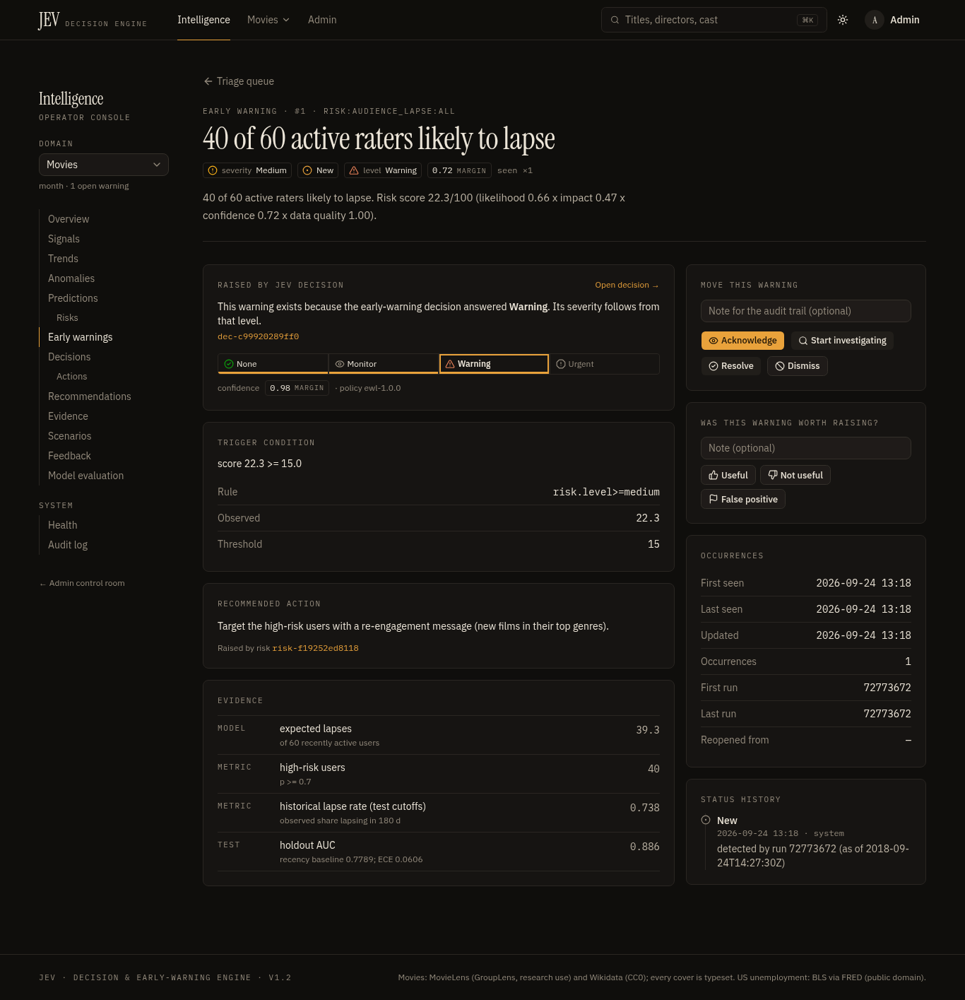 |
| 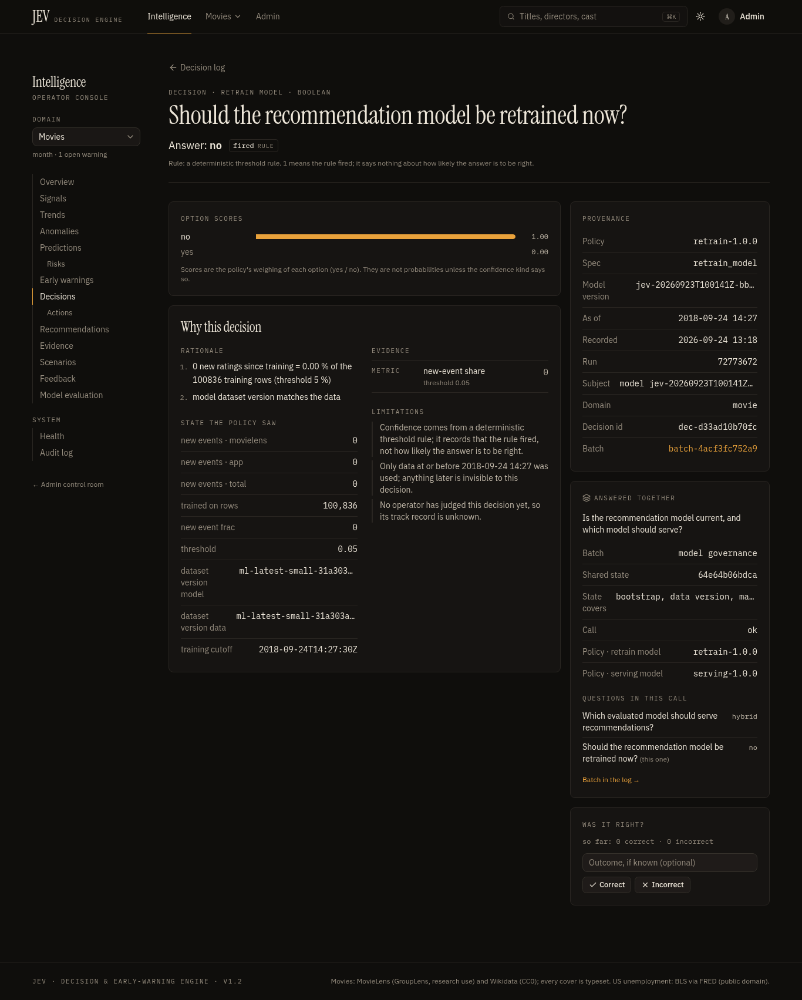 | 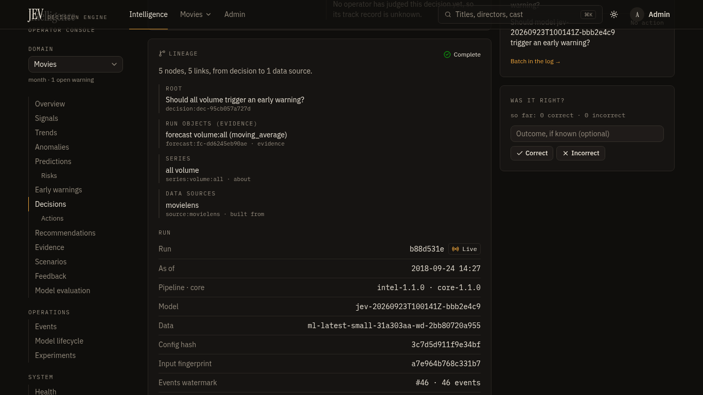 |
| 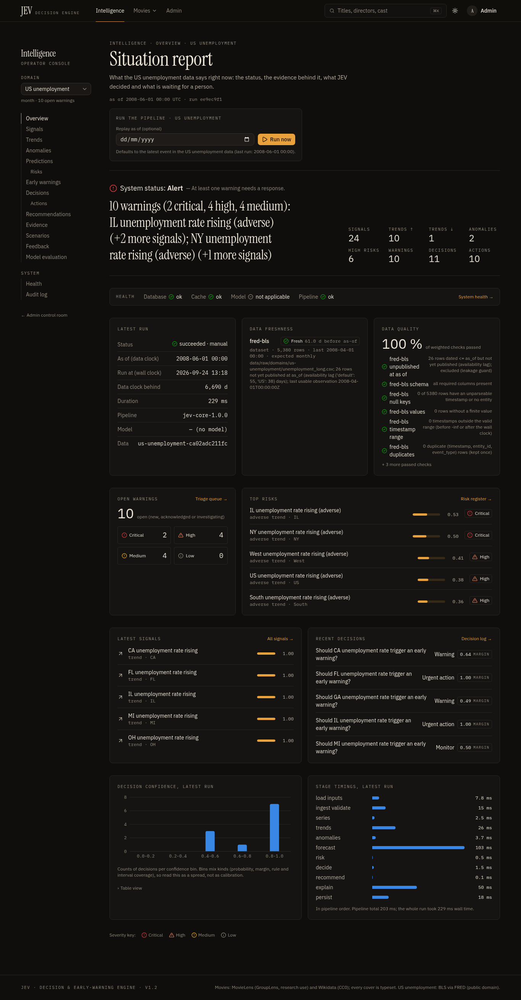 | 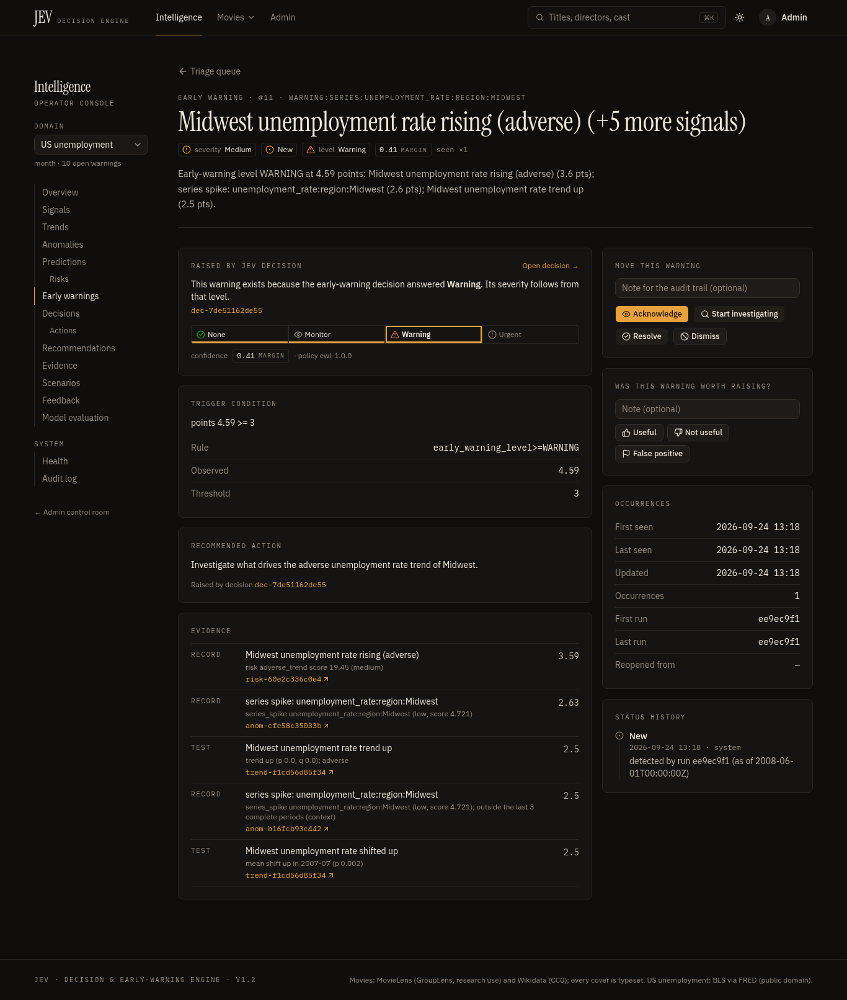 |
| 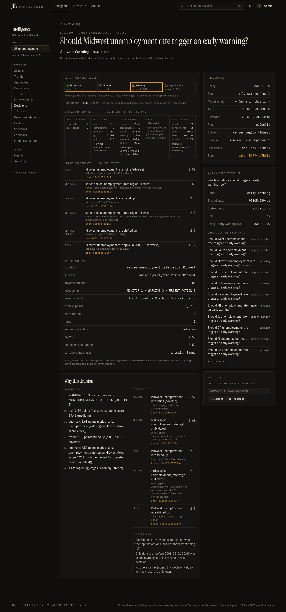 | 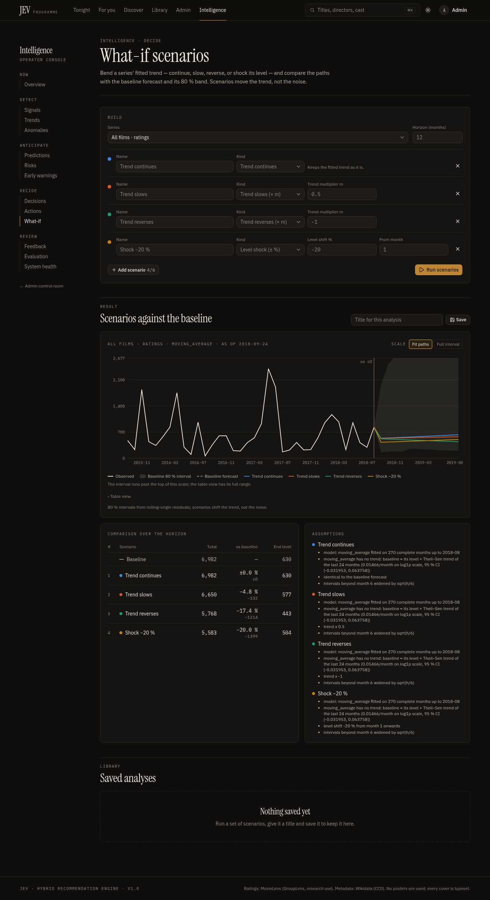 |
| 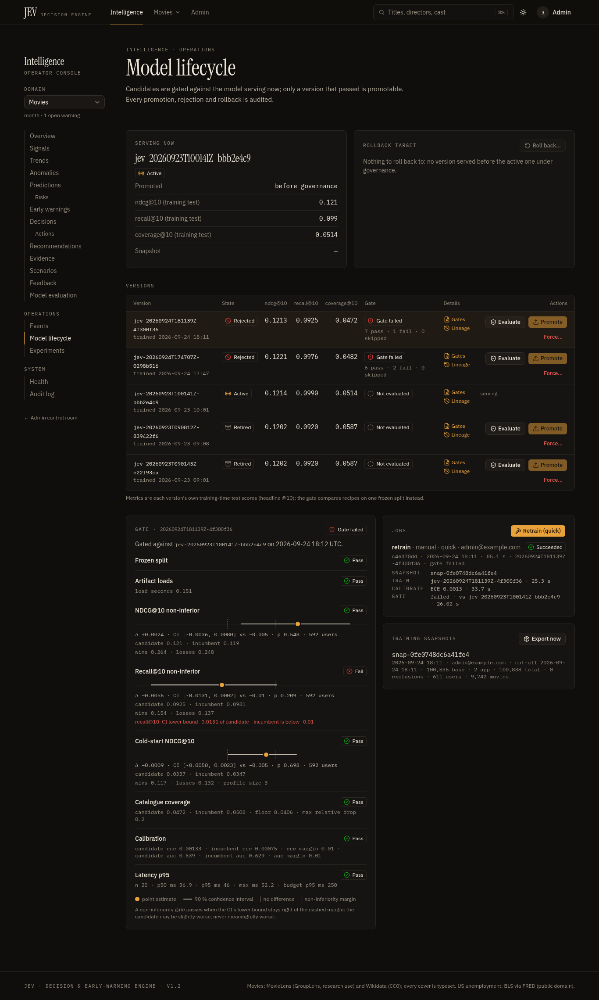 | 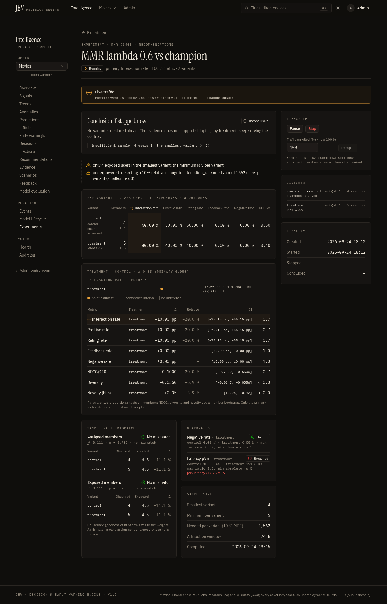 |
| 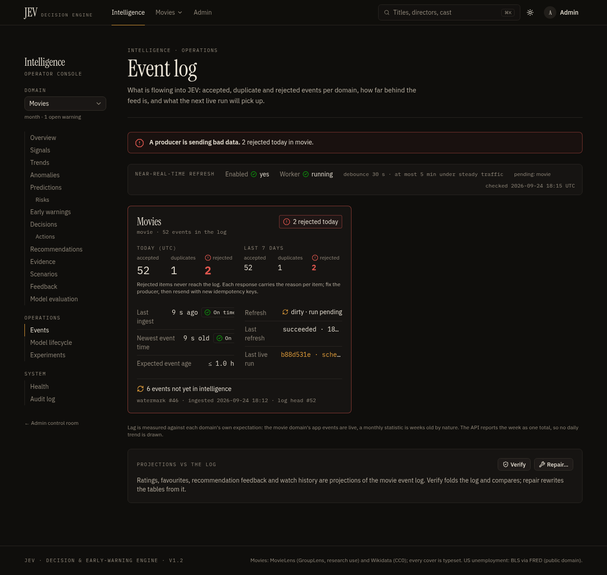 | 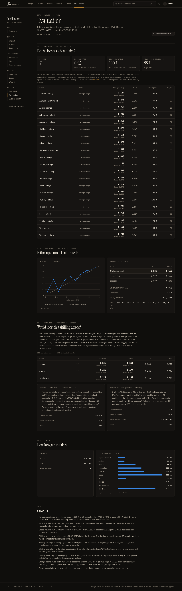 |
| 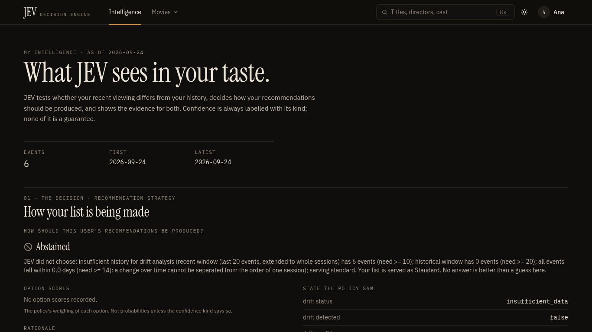 | 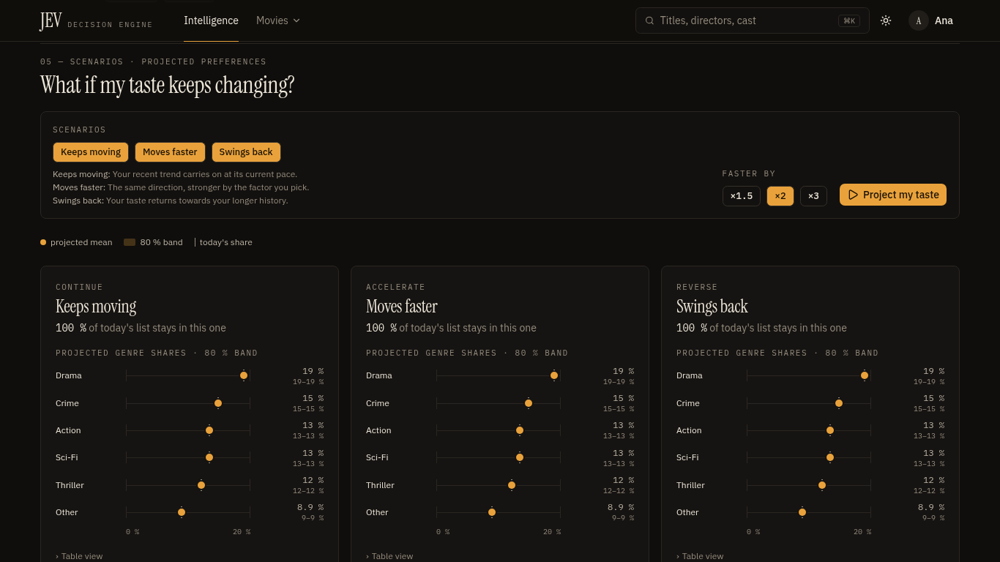 |
| 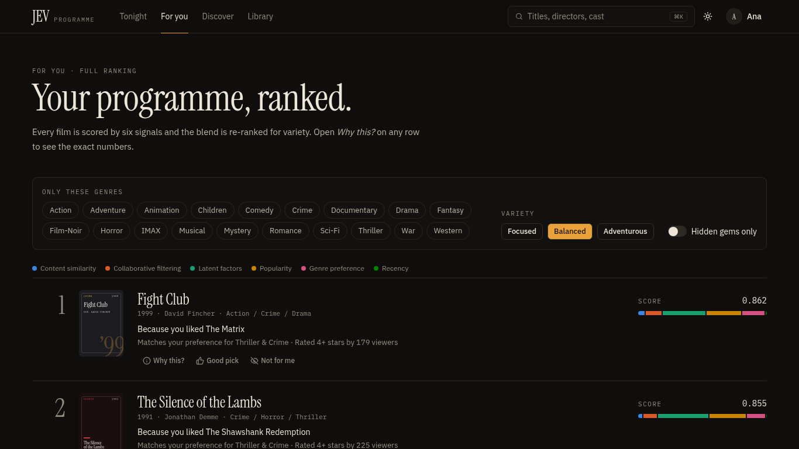 | 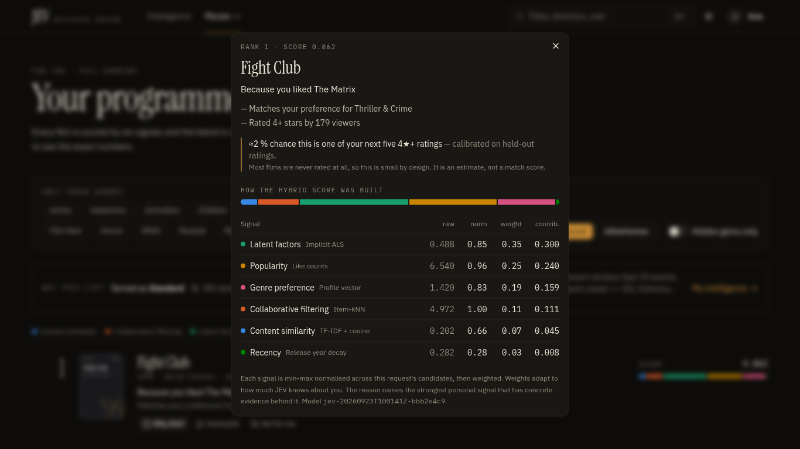 |
| 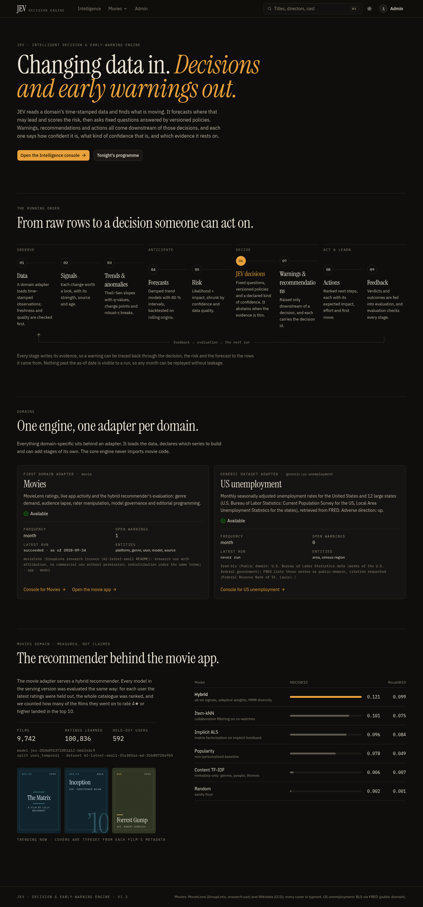 | 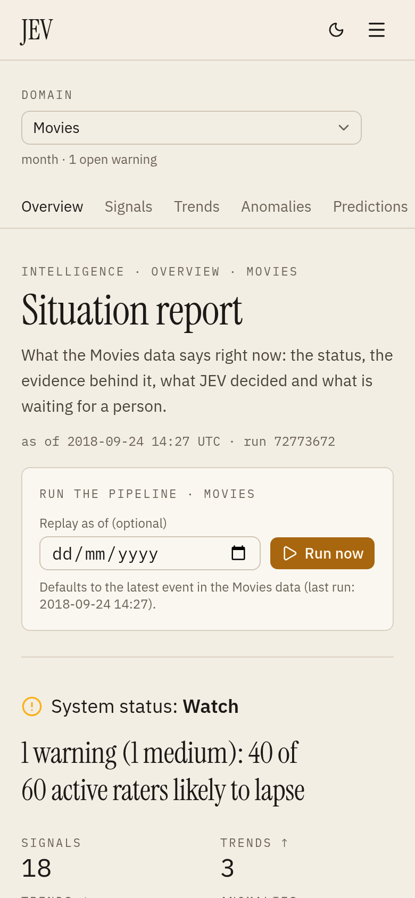 |

More (01–24): [docs/screenshots/](docs/screenshots/).

## Summary

JEV is a domain-independent decision and early-warning engine in Python (numpy, scipy, scikit-learn), FastAPI,
SQLAlchemy/Alembic, PostgreSQL/SQLite, Redis and Next.js/TypeScript, with three domains from one core: a MovieLens
hybrid recommender, US unemployment and Chicago transit ridership. It implements an append-only bitemporal event
log with idempotent ingestion, leak-free replays isolated from live state, typed and versioned decisions with
labelled confidence and abstention, early warnings with a full lifecycle, gated retraining with power-derived
non-inferiority tests and one-call rollback, and online A/B experimentation with SRM and multiple-testing control.
Every metric is reported with bootstrap CIs, base rates and lift, including the negative results, and was checked by
an independent validity review.

## Roadmap

Ordered by the gaps that remain after 1.3.0 ([docs/roadmap.md](docs/roadmap.md)):

1. **Live traffic.** Run an online experiment on real members; until then every online result is a replay.
2. **Paired offline experiment replay** (every member under every variant) in `scripts/simulate_ab_replay.py`.
3. **Warning skill.** A persistence rule for daily anomalies, per-domain early-warning thresholds tuned on a
   separate window, and a baseline rule (e.g. the Sahm rule for unemployment); report lift CIs for every domain.
4. **Recommender power.** Re-run the benchmark on MovieLens-1M/25M (same code); a time-decayed popularity signal
   inside the hybrid; learning-to-rank on logged feedback.
5. **Governance.** A shared calibration set (relative calibration or Brier skill) for the calibration gate; a
   post-promotion monitor that proposes rollback; API support for pinning a replay's model version.
6. **Operations.** Re-run the Docker acceptance test; retention jobs for `idempotency_keys` and `revoked_tokens`;
   a shared run lock across workers; password reset and email verification.
7. **Movie warnings.** Evaluate lapse warnings at a fixed flag rate or retire the lapse warning (keep the risk).

## Licence and credits
Code: MIT. Data: MovieLens © GroupLens (research use; not redistributed); Wikidata CC0; FRED/BLS public domain;
City of Chicago data portal (terms of use of the portal).
