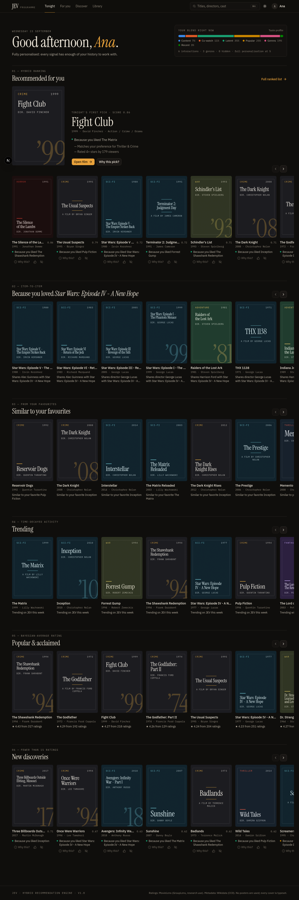

# JEV — Intelligent Hybrid Recommendation Engine

*A film programme that learns you.* JEV is a personalised movie recommender. It blends **content-based**,
**collaborative filtering**, **matrix factorization**, **popularity** and **behavioural** signals into one ranked list,
explains every pick from the model's actual evidence, and measures itself on a held-out test set.



## Problem statement
Single-strategy recommenders fail in predictable ways. Popularity is not personal. Collaborative filtering fails for
new users and new films. Content similarity keeps suggesting the same director. Latent factors are accurate but opaque.
JEV combines them in a ranking pipeline whose weights adapt to how much it knows about each user. It is diversified,
explainable and evaluated under one reproducible protocol.

## At a glance
| | |
|---|---|
| Dataset | MovieLens `ml-latest-small` (9,742 films, 100,836 ratings, 610 users) + Wikidata metadata (directors, cast, themes) |
| Models | Popularity · TF-IDF content · Item-kNN CF · Implicit ALS · **Hybrid** (6 signals, adaptive weights, MMR diversity) |
| Best result (test, 592 users) | **Hybrid NDCG@10 0.1214**, Recall@10 0.0990, HitRate@10 0.517: +21% NDCG over the best single model |
| Stack | FastAPI · SQLAlchemy + Alembic · PostgreSQL · Redis · Next.js 16 + TypeScript · Tailwind v4 · shadcn/ui · Recharts · Docker Compose |
| Laptop footprint | CPU only, no GPU or torch. Tuned training about 4.5 min, `--quick` training < 1 min, model load 0.1 s, about 25 ms per recommendation request |

## System architecture
```
Next.js (dark/paper UI) ──/api/*──► FastAPI ──► RecommendationEngine (loads models/<version>)
                                       │  └──► PostgreSQL (users, ratings, recs, feedback, registry mirror)
                                       └────► Redis (rec cache, rate limits)
offline: download → validate → clean → features → split → tune → evaluate → train → register → report
```
Details: [ARCHITECTURE.md](ARCHITECTURE.md).

## Recommendation algorithms
1. **Popularity**: log like-counts, time-decayed trending, and a Bayesian-average rating.
2. **Content-based**: separate TF-IDF per field (genres, directors, cast, keywords, tags, title, description, decade),
   field-weighted and cosine-scored, with a signed user taste vector.
3. **Collaborative filtering**: item-item cosine with shrinkage over the sparse implicit matrix, top-k neighbours.
4. **Matrix factorization**: implicit ALS (Hu–Koren–Volinsky), with exact fold-in for new users and exact score attribution.
5. **Hybrid**: candidate generation → filtering → six normalised signals → interaction-adaptive weighted score →
   quality floor → MMR diversity → top-K with pagination. Every item carries its per-signal breakdown and a reason
   built from real contributions: *"Recommended because of your interest in Christopher Nolan"*, *"Because you liked
   Inception"*, *"Viewers who enjoyed The Dark Knight also loved this"*.

Full description: [docs/recommendation-algorithms.md](docs/recommendation-algorithms.md).

## Dataset
MovieLens (GroupLens, research licence) is downloaded by script and MD5-verified; it is never committed. Wikidata (CC0)
enrichment is fetched by IMDb id: 9,651/9,742 films matched, 98.5% have a director. Fields, sizes, validation and
versioning are documented in [docs/ml-pipeline.md](docs/ml-pipeline.md).

## Installation
Requirements: Python 3.11+ with [uv](https://docs.astral.sh/uv/), Node 20.9+ with pnpm. Docker is optional.
```bash
cp .env.example .env            # set secrets
uv sync
cd frontend && pnpm install && cd ..
```

## Training
```bash
uv run python scripts/download_data.py      # --skip-enrichment to work offline
uv run python scripts/preprocess_data.py
uv run python scripts/train_models.py       # tune on validation, evaluate on test, train + register (≈4.5 min CPU)
uv run python scripts/train_models.py --quick   # no tuning
uv run python scripts/generate_recommendations.py --rate 79132=5 109487=5 --genres Sci-Fi
```

## Evaluation
Per-user temporal split (70/10/20), relevance = held-out rating ≥ 4, full-catalogue ranking with consumed items
excluded, the same protocol for every model. Numbers from run `jev-hybrid-v1-20260923T095709Z`:

| Model (test, K=10) | Precision | Recall | NDCG | MAP | HitRate | Coverage | Diversity | Novelty |
|---|---|---|---|---|---|---|---|---|
| **Hybrid** | **0.0946** | **0.0990** | **0.1214** | **0.0591** | **0.5169** | 0.0514 | 0.9211 | 2.29 |
| Item-kNN | 0.0828 | 0.0751 | 0.1006 | 0.0480 | 0.4358 | 0.0627 | 0.9178 | 2.54 |
| ALS | 0.0731 | 0.0840 | 0.0956 | 0.0451 | 0.4392 | 0.0786 | 0.9222 | 2.64 |
| Popularity | 0.0598 | 0.0489 | 0.0775 | 0.0379 | 0.3209 | 0.0093 | 0.9224 | 1.55 |
| Content | 0.0044 | 0.0069 | 0.0060 | 0.0026 | 0.0389 | 0.1242 | 0.5961 | 8.29 |
| Random | 0.0022 | 0.0009 | 0.0024 | 0.0007 | 0.0220 | 0.4530 | 0.9457 | 7.75 |

On the cold-start protocol (3 interactions) popularity still leads (NDCG@10 0.046 vs hybrid 0.035). See
[docs/evaluation.md](docs/evaluation.md) for the full tables, plots and discussion.

## API
REST under FastAPI with JWT (httpOnly cookie or bearer) and CSRF protection for cookie writes. Main endpoints:
`/auth/*`, `/users/me*`, `/movies*`, `/recommendations` (+ `/similar/{id}`, `/trending`, `/because-you-watched`,
`/similar-to-favorites`, `/feedback`, `/history`), `/models*`, `/experiments*`, `/health`, `/health/ml`.
Reference: [docs/api.md](docs/api.md). OpenAPI UI is at `http://localhost:8000/docs` in development.

## Frontend
Next.js 16 App Router. Pages: `/` landing (live metrics), `/login`, `/register`, `/onboarding` (genres → favourites →
quick ratings), `/home` (six shelves: Recommended for you, Because you watched, Similar to your favourites, Trending,
Popular, New discoveries), `/discover`, `/movies/[id]`, `/recommendations` (full ranking with "Why this?"
breakdowns and feedback), `/profile` (taste profile), `/history`, `/favorites`, `/admin`, `/admin/models`,
`/admin/experiments`.

The design is a festival programme printed for a dark screening room. It uses warm near-black and paper tones, a
single tungsten-amber accent, serif display type, and typeset covers generated from each film's metadata instead of
posters. A light "paper" theme is included. It is responsive from 360 px phones to 1440 px laptops, keyboard
accessible, and respects reduced-motion settings.
```bash
uv run uvicorn jev_api.main:app --port 8000      # SQLite + in-memory cache by default
cd frontend && pnpm dev                          # http://localhost:3000
```

## Docker
```bash
docker compose --profile train run --rm trainer  # first run: data + training into ./data ./models ./experiments
docker compose up -d --build                     # postgres, redis, api, web → http://localhost:3000
uv run python scripts/acceptance_test.py --base http://localhost:3000/api --admin-password "$JEV_ADMIN_PASSWORD"
```
See [docs/deployment.md](docs/deployment.md).

## Testing
```bash
uv run pytest                   # unit + ML + API integration (synthetic data, ~5 s; real-model checks when models/ exists)
uv run ruff check . && uv run ruff format --check . && uv run mypy
cd frontend && pnpm exec tsc --noEmit && pnpm exec eslint src && pnpm build
uv run python scripts/capture_screenshots.py     # real-browser user journey (Chrome) → docs/screenshots
```

## Screenshots
| | |
|---|---|
|  |  |
|  |  |
|  |  |
|  |  |

## Limitations
- **Cold start**: with about 3 interactions, plain popularity still beats the hybrid on NDCG@10.
- MovieLens-small is small (610 users) and old (ratings to 2018), so absolute metrics are modest and results may not
  transfer to other domains. The evaluation split allows cross-user temporal leakage (documented; a global temporal
  split is available).
- Wikidata metadata is incomplete: keywords cover 36% of films, and cast lists are unordered (Wikidata has no billing order).
- App users are not in the training data. They are served by fold-in, and their feedback is not yet fed back into retraining.
- No password reset or email verification; JWTs are not revocable before expiry.
- Posters are typeset, not artwork.

## Future improvements
Separate cold-stage weights or learning-to-rank on logged feedback · sequence-aware models · scheduled retraining that
includes app interactions · online A/B tests driven by the experiment table · larger MovieLens variants · optional
TMDB artwork. See [docs/roadmap.md](docs/roadmap.md) and [docs/progress.md](docs/progress.md).

## Licence and credits
Code: MIT. Data: MovieLens © GroupLens (research use; not redistributed); Wikidata CC0.
