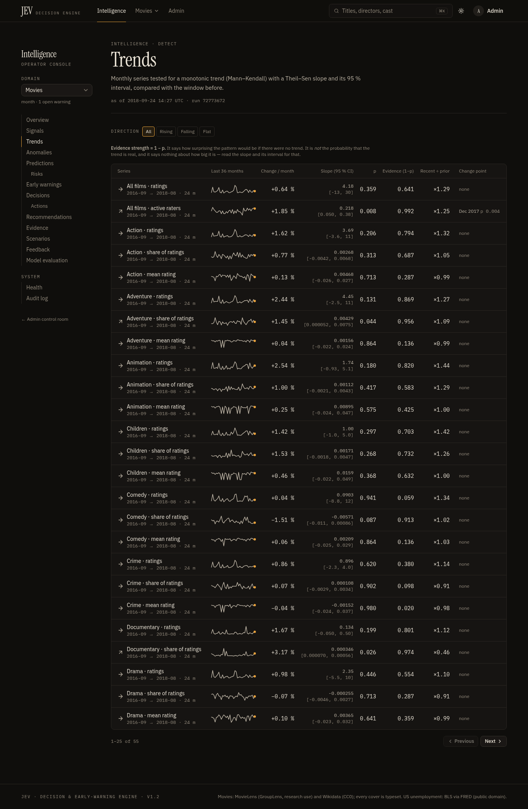
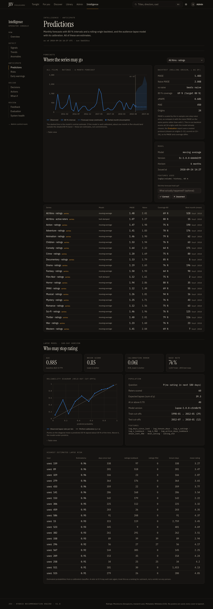
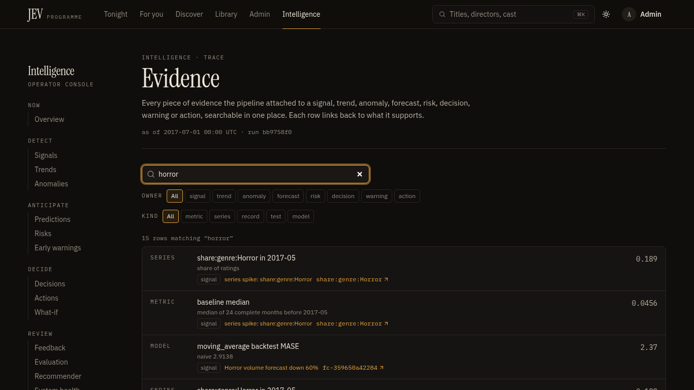
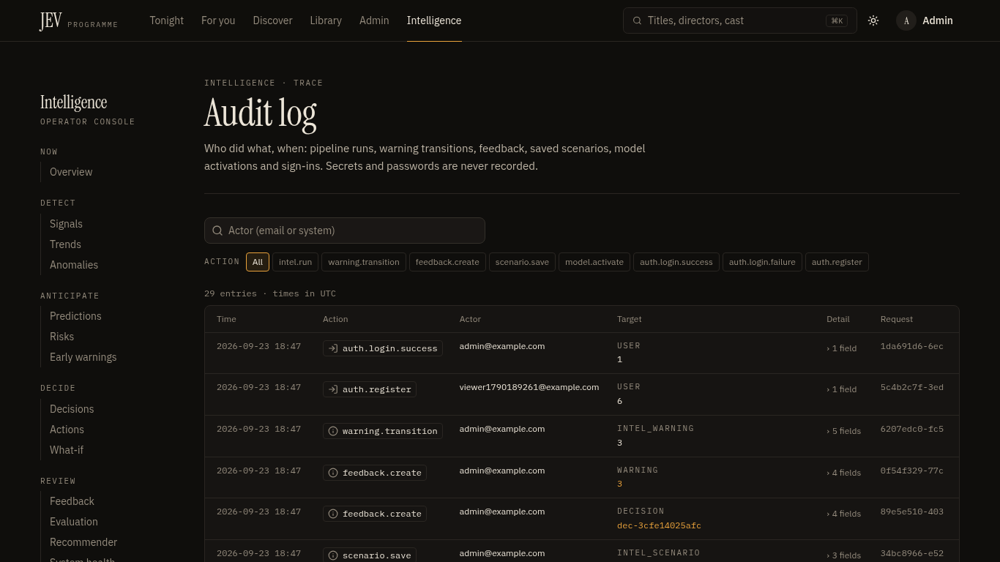
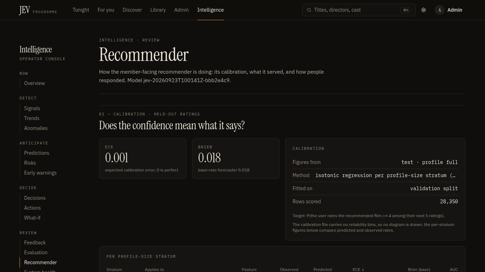

# JEV demo walkthrough

A guided tour for a recruiter, professor or reviewer. It takes you from a clean checkout to a recorded operator
verdict. The route follows the spec's demo flow: start the app, load the data, show freshness, show the detection and
decision layer with its evidence, show the recommended action, run a what-if, submit feedback, then show the recorded
outcome.

Every number below was observed on 2026-09-23/24 with the committed model `jev-20260923T100141Z-bbb2e4c9`, the
MovieLens `ml-latest-small` snapshot (dataset version `ml-latest-small-31a303aa-wd-2bb80720a955`) and a fresh database.
The pipeline is deterministic for a given `as_of`, so you should see the same values. The exceptions are the timings,
the run ids and the database ids, which depend on what the database already holds.

**Short on time?** Jump to the [5-minute script](#5-minute-script).

---

## 1. Start the app

### Option A: Docker (PostgreSQL + Redis, closest to production)
```bash
cp .env.example .env        # set POSTGRES_PASSWORD, JEV_JWT_SECRET, JEV_ADMIN_EMAIL, JEV_ADMIN_PASSWORD (and JEV_UID/JEV_GID if `id -u` is not 1000)
docker compose up -d --build        # db, cache, api, web; first build about 2.5–3 min, later starts about 10 s
docker compose ps                   # api and web should say (healthy)
```
Open <http://localhost:3000>. The API is not published to the host; the browser reaches it through the web proxy at
`http://localhost:3000/api`. Details are in [deployment.md](deployment.md).

### Option B: local, no Docker (SQLite + in-memory cache)
```bash
uv sync && (cd frontend && pnpm install)
JEV_ADMIN_EMAIL=admin@example.com JEV_ADMIN_PASSWORD=admin-pass-123 \
  uv run uvicorn jev_api.main:app --port 8000          # terminal 1
cd frontend && pnpm build && pnpm start -p 3000         # terminal 2 (or `pnpm dev`)
```
Startup runs the migrations (0001 → 0004), loads the model in about 0.1 s, seeds the 9,742-film catalogue,
creates the admin, and starts the first intelligence run in a background thread. That run takes about 1 s.

Sign in at <http://localhost:3000/login> with the admin account, then click **Intelligence** in the top bar.

## 2. Load and ingest the data

The repository does not include MovieLens (it is under a research licence). If `data/processed/` and `models/` are
empty, build them once:
```bash
uv run python scripts/download_data.py              # MD5-verified MovieLens + Wikidata enrichment (--skip-enrichment offline)
uv run python scripts/preprocess_data.py
uv run python scripts/train_models.py --calibrate   # about 4.5 min CPU; --quick < 1 min; --calibrate writes models/<v>/calibration.json
uv run python scripts/evaluate_intelligence.py      # optional: offline evaluation → experiments/intel-eval-*/
```
With Docker, the same steps run with `docker compose --profile train run --rm trainer`.

Ingestion then happens on every intelligence run: it reads `data/processed`, the app database and the active model's
manifest, and validates them. To ingest again by hand, click **Run now** on the Situation report, or:
```bash
uv run python scripts/run_intelligence.py           # one run, printed as JSON
```

## 3. Show data freshness

**Intelligence → Overview** (`/intel`) opens the *Situation report*.


What the viewer sees on a fresh database (startup run, as of the last MovieLens event):
- Headline: **"1 warning (1 medium): 40 of 60 active raters likely to lapse"**, status **Watch**.
- Counters: 18 signals, 3 trends up, 1 trend down, 10 anomalies, 0 high risks, 1 warning, 42 decisions, 1 action.
- **Data freshness** card:
  - `movielens`: *Archival · 2,921 d old*, 100,836 rows, last event 2018-09-24 14:27. The text reads "archival snapshot:
    its age is reported, not alarmed".
  - `app`: *No events yet*. Freshness "cannot be assessed" until real users rate films.
  - `model`: trained 2026-09-23 10:01, same data version.
- **Data quality**: 100 % of the 10 weighted checks passed (for example, 34 of 9,742 films have no genre, under the 5 %
  threshold).
- **Health**: database, cache, model and pipeline all ok. **Stage timings**: about 0.95 s in total; forecast (≈235 ms)
  and lapse (≈210 ms) are the slowest stages.

*Talking point:* a stale static snapshot is *reported*, not raised as an alarm, and a source with no events says "cannot
be assessed" instead of making up a value.

## 4. Signals, a trend, an anomaly, a prediction, a risk, a decision and its evidence

### Signals (`/intel/signals`)
Eighteen deduplicated signals, each with a strength and its evidence. The top ones are *series spike:
share:genre:Documentary* (strength 1.00), *Hybrid leads itemknn by 20.7 % NDCG@10* (1.00) and *all active_users shifted
up in 2017-12* (0.996). Open a signal to see its history across runs.

### A trend (`/intel/trends`)


Out of 55 series, four trends survive at p < 0.05. The strongest is **active_users:all ↑**, with a Theil–Sen slope of
+0.22 users/month (95 % CI 0.05 to 0.375), +1.85 %/month and Mann–Kendall p = 0.008. After Benjamini–Hochberg
correction, q = 0.43. *Talking point:* the UI reports that q-value, because on a stream of 10 to 15 active raters a
month very little survives false-discovery control, and the page says so.

### An anomaly: replay 2017-07-01 for the Horror spike
On the Situation report, in **Run the pipeline**, set *Replay as of* to **2017-07-01** and click **Replay**. The replay
takes about 1 s, never looks past that date, and becomes the run the console shows.

- The headline changes to **"1 warning (1 high): share:genre:Horror spike in 2017-05"**, status **Alert**, with 21
  signals, 18 anomalies, 44 decisions (10 abstained) and 2 actions.
- **Anomalies** (`/intel/anomalies`) lists *series_spike share:genre:Horror, 2017-05, high*. Horror's share of ratings
  was **0.189**, against a trailing 24-month median of **0.0456**, a robust z of **7.85** (the threshold is 3.5).
- **Early warnings → #2** (`/intel/warnings/2` on a fresh database) shows:
  - the trigger condition `|robust z| 7.85 >= 3.5` (rule `anomaly.severity>=medium`);
  - the evidence rows (series value, baseline median, robust z, anomaly record);
  - the status history ("detected by run … as of 2017-07-01").


### A prediction: forecast fan and lapse model (`/intel/predictions`)


- **Forecast fans.** There are 21 series, each with the model chosen by rolling-origin MASE and a finite-sample 80 %
  band. As of 2017-07-01, `volume:genre:Horror` uses a moving average: 48.3 ratings next month, 80 % band 6.9 to 258.
  Its backtest MASE is 2.37 against 2.91 for naive, over 24 origins, with a backtested coverage of 0.66. The wide band
  is honest, because the series is thin.
- **Lapse model.** This is a calibrated logistic regression of P(no rating in 180 days).
  - Holdout AUC is **0.886** on the latest data (0.876 as of 2017-07-01), against **0.779** for the recency rule. ECE
    is 0.061.
  - As of 2017-07-01 it scores 50 recently active raters: 30 are at high risk (p ≥ 0.7), and 32.7 lapses are expected.

### A risk (`/intel/risks`)
**audience_lapse**: *40 of 60 active raters likely to lapse*, score **22.3/100** (medium). The score is likelihood 0.66
× impact 0.47 × confidence 0.72 × data quality 1.00, and each factor lists its contribution and where it came from. As
of 2017-07-01 the same risk is *30 of 50*, score 14.45 (low). Open a risk to see its score history across runs.

### A JEV decision: a score decision and a batch (`/intel/decisions`)
On the decision log, find *"What share of home-rail slots should carry Horror films next quarter?"* (key
`editorial_slot_share`, from the latest-data run; `/intel/decisions/30` on a fresh database).


- **Answer: 7.06 % of home-rail slots**, with an **80 % interval of 3.87 to 13.3**. The kind is `score` and the
  confidence kind is `interval`. The page states that the confidence is the interval's nominal coverage, not a
  probability of being right.
- **Why this decision:**
  - the rationale ("moving_average forecast of the Horror share of ratings for 2018-09..2018-11: 7.1 %");
  - the full state the policy saw (forecast id, a backtested coverage of 0.75 over 12 origins, 22 window residuals);
  - the evidence, the limitations, and the provenance (policy `slot-share-1.0.0`, model version, as_of).
- **Answered together.** The right-hand column shows the **genre_programming** batch: 36 questions answered against one
  shared, hashed state (`4bb24728e8ff…`), with 3 abstentions (Drama, Comedy and Adventure: their backtested coverage is
  too low to state an interval). Click **Only this batch →** to filter the log by `batch_id`.
- The other batches are **model_governance** (retrain: *no*, rule; serving: *hybrid*, P = 1.000 by paired bootstrap
  over 592 users) and **audience** (re-engagement campaign: *yes*; 3 rater actions: *ignore*).
- *Talking point:* in the 2017-07-01 replay, retrain and serving **abstain**, with the reason "model was trained on data
  after as_of (replay): a retrain decision would use future information".

### Evidence explorer (`/intel/evidence`)
Type **horror** in the search field: 15 rows match. Each row links back to the signal, forecast or decision it supports,
and to its series.



## 5. Show the recommended action

- On the warning page, the **Recommended action** panel reads: *"Check whether the change comes from a few users or a
  catalogue event before acting on it."*
- **Actions** (`/intel/actions`), after the replay:
  - **P1** *Investigate: share:genre:Horror spike in 2017-05*, sourced from the warning.
  - **P2** *Re-engage 30 users at high lapse risk*, sourced from the re-engagement decision. Next step: "export the
    high-risk list and schedule a personalised new-releases message". Its effort is labelled a *declared estimate*.

## 6. Run a what-if scenario

Open **What-if** with the series preset: <http://localhost:3000/intel/scenarios?series=volume:genre:Horror>. Leave
the 12-month horizon and the four preset scenarios, then click **Run scenarios**. To keep the analysis, give it a title
and click **Save**.


As of 2017-07-01 (moving-average baseline, 672 Horror ratings over 12 months):

| Scenario | 12-month total | vs baseline | End level |
|---|---|---|---|
| Trend continues | 672 | 0.0 % | 63.2 |
| Trend slows (×0.5) | 624 | −7.2 % | 55.3 |
| Shock −20 % | 536 | −20.4 % | 50.3 |
| Trend reverses (×−1) | 503 | −25.2 % | 36.9 |

The page notes: "80 % intervals from rolling-origin residuals; scenarios shift the trend, not the noise."

## 7. Submit feedback

- On the Horror slot-share decision, under **Was it right?**, click **Correct**. You can add an outcome note first.
- On warning #2, click **Acknowledge** (the status history gains *New → Acknowledged · admin@example.com*). Then, under
  **Was this warning worth raising?**, click **Useful**. A toast confirms each action ("Recorded: useful").
- Optionally, mark a forecast **Correct** / **Incorrect** on the Predictions page, or an action **Useful** on Actions.

## 8. Show the recorded outcome

**Feedback** (`/intel/feedback`) shows both verdicts: *warning 2 → useful* and *decision dec-e501a176fdce → correct*,
both by admin@example.com. The accuracy and precision tiles say **"Not enough feedback yet"** (1 correct · 0 incorrect;
1 useful). They show a rate only after 5 verdicts, so a single click never reads as "100 % accurate". The API returns
the raw ratio (`GET /intel/feedback` → `summary.decision.accuracy = 1.0`).

**Audit log** (`/intel/audit`) lists every step above with actor, target and request id:
- `auth.login.success`;
- `intel.run` (the startup run as actor `system`, then your replay);
- `warning.transition` (5 fields: key, from, to, note, severity);
- `feedback.create` ×2;
- `scenario.save` (if you saved).

Filter by action, or by actor. Passwords and tokens are never recorded.



To close the loop on the recommender itself, **Recommender** (`/intel/recommendations`) shows the calibration of
member-facing confidence (ECE 0.001, Brier 0.018 on the test split), plus what was served and how people responded.



### Check it all automatically
The acceptance test drives the same flow through the web proxy, and 58 checks pass (it creates its own users, runs
and verdicts):
```bash
uv run python scripts/acceptance_test.py --base http://localhost:3000/api --admin-password "$JEV_ADMIN_PASSWORD"
```

---

## 5-minute script

| Time | Where | Say / do | The viewer sees |
|---|---|---|---|
| 0:00 | Terminal | `docker compose up -d --build` has already run (or the local option). "One command, CPU only, no API keys." | `docker compose ps`: api and web healthy |
| 0:20 | `/recommendations` as a member (optional) | "The product: a hybrid recommender. Every item says why, and how likely you are to rate it 4★+." | A ranked list with reasons; confidence around 1–2 % (it is calibrated, not a match score) |
| 0:45 | `/intel` | "The operator side. As of the last MovieLens event the system says *Watch*: 40 of 60 active raters are likely to lapse." | Headline, counters, freshness: MovieLens archival 2,921 days, app "no events yet", quality 100 % |
| 1:15 | `/intel/trends` | "Trends are tested, not eyeballed: Theil–Sen slope, Mann–Kendall, then false-discovery control." | active_users ↑, p = 0.008, q = 0.43 |
| 1:40 | `/intel` → Replay **2017-07-01** | "Replay the past, leak-free. What would JEV have said in July 2017?" | Status *Alert*: high warning, Horror spike in 2017-05 |
| 2:00 | `/intel/warnings/2` | "Horror's share jumped to 19 % from a 4.6 % baseline (robust z 7.85). Here is the rule, the evidence and the recommended action." | Trigger 7.85 ≥ 3.5, evidence rows, "check whether it comes from a few users…" |
| 2:30 | `/intel/predictions` | "Forecasts carry honest 80 % bands. The lapse model beats the recency rule." | Horror fan 6.9–258; lapse AUC 0.876 vs 0.779 |
| 2:50 | `/intel/decisions` → Horror slot share | "JEV is the decision layer: typed questions and versioned policies, no LLM. This is a score decision with an interval, answered in a batch against one hashed state." | 7.06 % [3.87, 13.3], 80 % interval; batch of 36, 3 abstained |
| 3:30 | `/intel/evidence`, search "horror" | "Every claim is traceable." | 15 matching evidence rows linked to their owners |
| 3:50 | `/intel/scenarios?series=volume:genre:Horror` → Run | "What if the trend reverses?" | Continue 672 · slows −7.2 % · shock −20.4 % · reverses −25.2 % |
| 4:20 | Decision → **Correct**; warning → **Acknowledge**, **Useful** | "Operators judge the system." | Toasts; status history New → Acknowledged |
| 4:40 | `/intel/feedback`, then `/intel/audit` | "The verdicts become the layer's track record, and everything is audited." | 1 correct, 1 useful ("not enough feedback yet"); audit rows for login, run, transition, feedback |
| 5:00 | — | "Limits, honestly: a 2018 snapshot, a thin live stream, and the change-point test over-alarms at 7 % vs 1 % nominal. They are all documented." | [progress.md](progress.md#known-limitations) |
