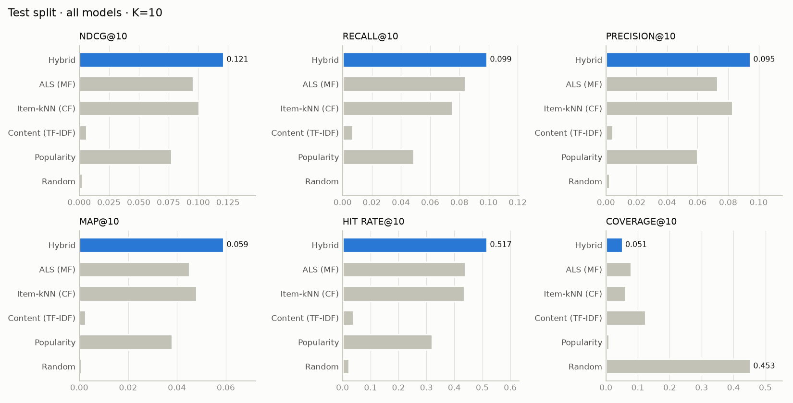
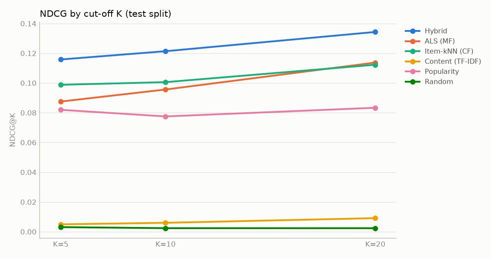
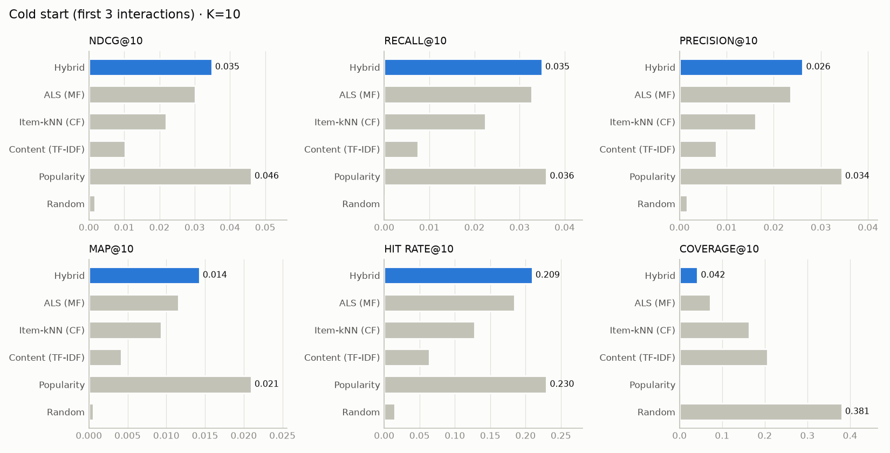

# Evaluation

All numbers below were produced by `uv run python scripts/train_models.py` (run `jev-hybrid-v1-20260923T095709Z`, serving model
`jev-20260923T100141Z-bbb2e4c9`, dataset `ml-latest-small-31a303aa-wd-2bb80720a955`, seed 42). They are copied from
`experiments/jev-hybrid-v1-20260923T095709Z/REPORT.md`. Re-running the command regenerates them; nothing here was typed in by hand.

## Protocol

- **Split: per-user temporal (leave-latest-out).** Each user's ratings are sorted by time. The latest 20% form the
  test set, the previous 10% validation, the rest train: 70,579 / 10,093 / 20,164 rows, all 610 users.
  A user's future is never used to predict their past. *Caveat:* other users' later ratings may still be in training.
  `split.strategy: global_temporal` removes that leakage, at the cost of evaluable users.
- **Relevance:** a held-out rating ≥ 4.0. Users are evaluated when they have at least one relevant test item and
  history in train (**592 users**).
- **Candidates:** the whole catalogue (9,742 films) minus everything in the user's training profile. The evaluator
  raises an error if a model returns an already-consumed item.
- **Same protocol for every model:** same users, profiles, exclusions and K ∈ {5, 10, 20}.
- **Tuning happens on validation only** (models fitted on train). Test numbers come from models refitted on train+val.
  The production model is then refitted on all data.
- **Cold-start protocol:** the same test targets, but each user's profile is truncated to their *first 3* training
  interactions and treated as unseen (ALS fold-in path, like a new app user).

Metrics: Precision, Recall, F1, NDCG, MAP and HitRate at K (binary relevance); catalogue coverage (share of the
catalogue recommended to anyone); intra-list diversity (1 − mean pairwise content cosine of each top-10); novelty
(mean −log₂ of each item's popularity share).

## Results: test split, K = 10 (592 users)


| model | precision@10 | recall@10 | f1@10 | ndcg@10 | map@10 | hit_rate@10 | coverage@10 | diversity@10 | novelty@10 |
|---|---|---|---|---|---|---|---|---|---|
| Hybrid | **0.0946** | **0.0990** | **0.0768** | **0.1214** | **0.0591** | **0.5169** | 0.0514 | 0.9211 | 2.29 |
| ALS (MF) | 0.0731 | 0.0840 | 0.0622 | 0.0956 | 0.0451 | 0.4392 | 0.0786 | 0.9222 | 2.64 |
| Item-kNN (CF) | 0.0828 | 0.0751 | 0.0636 | 0.1006 | 0.0480 | 0.4358 | 0.0627 | 0.9178 | 2.54 |
| Content (TF-IDF) | 0.0044 | 0.0069 | 0.0043 | 0.0060 | 0.0026 | 0.0389 | 0.1242 | 0.5961 | **8.29** |
| Popularity | 0.0598 | 0.0489 | 0.0431 | 0.0775 | 0.0379 | 0.3209 | 0.0093 | 0.9224 | 1.55 |
| Random | 0.0022 | 0.0009 | 0.0011 | 0.0024 | 0.0007 | 0.0220 | **0.4530** | **0.9457** | 7.75 |





**Reading it:** the hybrid is best on every accuracy metric. It gains about 21% NDCG@10 over the best single model
(item-kNN) and about 57% over popularity. Its HitRate@10 is 0.517, meaning half of users find at least one film they
later rated 4★+ in their top 10. The price is lower coverage and novelty than the collaborative models: popularity,
a strong signal on MovieLens, pulls the blend towards well-known titles. The MMR pass keeps intra-list diversity at 0.92.
Pure content-based TF-IDF is weak on this protocol (0.006). Metadata matches favour obscure titles that users rarely go
on to rate. That is why the hybrid multiplies content by a support prior. The content model's real value is cold-start
items and explanations.

## Results: cold start (profiles truncated to 3 interactions), K = 10


| model | precision@10 | recall@10 | f1@10 | ndcg@10 | map@10 | hit_rate@10 | coverage@10 | diversity@10 | novelty@10 |
|---|---|---|---|---|---|---|---|---|---|
| Hybrid | 0.0262 | 0.0350 | 0.0252 | 0.0349 | 0.0143 | 0.2095 | 0.0425 | 0.9076 | 2.05 |
| ALS (MF) | 0.0236 | 0.0328 | 0.0224 | 0.0302 | 0.0116 | 0.1841 | 0.0728 | 0.9095 | 2.53 |
| Item-kNN (CF) | 0.0162 | 0.0224 | 0.0158 | 0.0220 | 0.0094 | 0.1284 | 0.1637 | 0.9053 | 3.51 |
| Content (TF-IDF) | 0.0078 | 0.0075 | 0.0059 | 0.0102 | 0.0042 | 0.0642 | 0.2059 | 0.7200 | 6.32 |
| Popularity | **0.0345** | **0.0360** | **0.0297** | **0.0460** | **0.0210** | **0.2297** | 0.0013 | 0.9269 | 1.37 |
| Random | 0.0017 | 0.0003 | 0.0005 | 0.0018 | 0.0006 | 0.0152 | **0.3808** | **0.9456** | **7.73** |



**Honest finding:** with only 3 interactions, plain popularity beats the hybrid (NDCG@10 0.046 vs 0.035), although the
hybrid beats every other personalised model there. The cold-start sweep (ramp × boost × content damping) improved the
hybrid's cold score, but not past popularity, because it optimises the *average* of warm and cold NDCG. See the
roadmap for the planned fix: a separate cold-stage weight set, or learning-to-rank on logged feedback.

## Tuning outcome (validation)

- item-kNN: k = 50, shrinkage 0 (9 configurations)
- ALS: 32 factors, λ = 0.01, α = 5, 15 iterations (12 configurations)
- hybrid weights (best of 24 Dirichlet samples + defaults): content 0.067, collaborative 0.111, latent 0.352,
  popularity 0.251, preference 0.191, recency 0.028. MMR λ = 0.8 (the most diverse setting within 2% of the best NDCG).

## Recommendation confidence (calibration)

Model `jev-20260923T100141Z-bbb2e4c9`, calibration `cal-1.0.0-0546c1bffc` (`models/<version>/calibration.json`).
Target: P(the user rates a recommended film ≥ 4 among their next 5 ratings), top-50 lists. Fit: isotonic regression
on the **validation** split, with models fitted on train only (401 users, 20 050 candidates per stratum). Evaluation:
the **test** split, with models refitted on train+validation and the calibrators unchanged (567 users, 28 350
candidates per stratum). The baseline is the constant validation base rate of the stratum.

| stratum (profile interactions) | feature | test observed | test mean predicted | ECE | Brier | base-rate Brier | AUC |
|---|---|---|---|---|---|---|---|
| 0–1 (fitted with 0) | rank | 0.85 % | 0.73 % | 0.0011 | 0.00839 | 0.00840 | 0.58 |
| 2–5 (fitted with 3) | rank | 0.79 % | 0.71 % | 0.0008 | 0.00787 | 0.00787 | 0.57 |
| 6–30 (fitted with 10) | score | 0.99 % | 0.85 % | 0.0014 | 0.00982 | 0.00982 | 0.57 |
| ≥ 31 (full profile) | rank | 1.83 % | 1.76 % | 0.0008 | 0.01789 | 0.01797 | 0.63 |

In the warm stratum, rank 1 maps to 5.7 %, ranks 2–5 to 3.2 %, and rank 50 to 0.75 %. Using the raw hybrid score
as a probability would give ECE 0.63 and Brier 0.41.

**Honest reading.** The probabilities are *calibrated in level*: ECE ≤ 0.0014, and the predicted mean is within
0.15 percentage points of the observed rate in every stratum. They carry *little discrimination*: AUC 0.57–0.63, and
the Brier skill over the constant base rate is +0.45 % warm and about 0 for short profiles. A confidence of 5 % at
rank 1 means what it says, but it barely separates good recommendations from weak ones within a user's list. Over the
full test window (about 20 % of each user's ratings, a longer horizon than the calibrator's 5 ratings) the observed
rate is 5.5 % vs 1.8 % predicted. That gap is expected by construction, because the label horizon differs. It is
reported so the horizon is not misread. Before the profile-size strata were added, a single warm calibrator
over-predicted 3-interaction profiles by 2.2× (1.76 % vs 0.79 %).

## Reproduce

```bash
uv run python scripts/train_models.py            # tune + evaluate + train (~4–5 min on CPU)
uv run python scripts/evaluate_models.py         # re-evaluate the active version's parameters on the same protocol
uv run python scripts/calibrate_recommendations.py   # recommendation-confidence calibration (~20 s)
```
Outputs: `experiments/<run>/{metrics.json, comparison_test.csv, comparison_cold_start.csv, per_user_ndcg10.json, REPORT.md, plots/*.png, config.yaml, dataset_meta.json}`.
The admin dashboard (`/admin/experiments`) reads the same files through the API.
